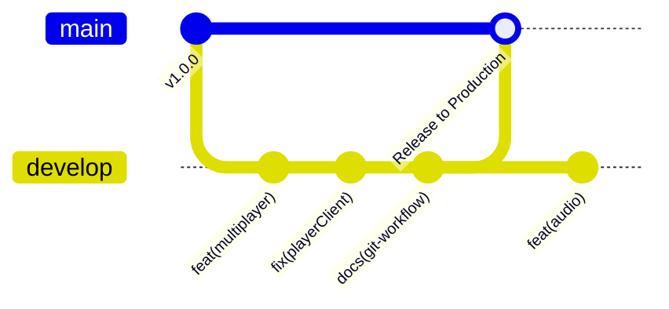
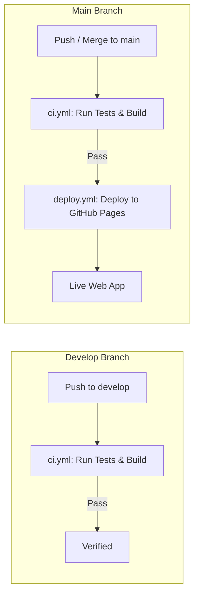

# Git Workflow & Conventional Commits Specification

This document defines the version control standards, branch strategy, Conventional Commits specification, and CI/CD deployment pipeline for the **Mafia Party Game Assistant (MPGA)** project.

---

## 1. Branch Strategy

MPGA uses a clean dual-branch Git workflow:



### Branches:
* **`main` (Production):**
  * The production release branch.
  * Every commit pushed to `main` triggers automated unit testing, production bundling, and live deployment to **GitHub Pages**.
  * Code on `main` must always be stable, tested, and releasable.
* **`develop` (Active Development):**
  * The primary integration branch where all feature development, refactoring, and bug fixes land.
  * Automated CI runs tests and builds on every push to `develop` to verify code health without triggering live production deployments.
* **Feature Branches (`feat/...`, `fix/...`):**
  * Optional topic branches for large or isolated refactors, branched from and merged back into `develop`.

---

## 2. Conventional Commits Standard

All commits in MPGA **MUST** adhere strictly to the [Conventional Commits 1.0.0](https://www.conventionalcommits.org/en/v1.0.0/) specification.

### Commit Format:
```text
<type>(<optional scope>): <imperative description>

[optional body explaining context and rationale]

[optional footer(s)]
```

### Commit Types:

| Type | Description | Example |
| :--- | :--- | :--- |
| `feat` | A new user-facing feature or capability | `feat(multiplayer): add dual-transport MQTT cloud relay` |
| `fix` | A bug fix in game logic, UI, or services | `fix(playerClient): resolve lobby roster sync on QR join` |
| `docs` | Documentation changes or additions | `docs(rules): add Nostradamus night inquiry details` |
| `refactor` | Code restructuring without changing behavior or adding features | `refactor(store): migrate state management to Pinia` |
| `perf` | Performance improvement | `perf(audio): optimize procedural sound synthesis` |
| `test` | Adding or modifying unit / integration tests | `test(voting): add tie-breaker roulette edge cases` |
| `build` | Changes to build tools, dependencies, or bundler configs | `build: update distribution bundle with latest assets` |
| `ci` | Changes to CI/CD workflows and automated scripts | `ci: separate CI validation from GitHub Pages deployment` |
| `chore` | Maintenance tasks, license, or boilerplate | `chore: update copyright notices and licensing` |
| `style` | Code formatting, whitespace, or lint fixes (no code changes) | `style(tailwind): standardize button active state styling` |

### Scopes:
Common scopes used across the codebase:
* `multiplayer` — P2P WebRTC, MQTT Cloud Relay, peer connections, room codes.
* `playerClient` — Mobile player web app views and components.
* `moderator` — Game moderator cockpit, step navigation, and timer controls.
* `voting` — Pre-vote tally, defense phase, and final voting logic.
* `roles` — Character definitions, night actions, and ability handlers.
* `audio` — Web Audio API sound synthesis and atmospheric soundscapes.
* `store` — Pinia store state management.
* `i18n` — English and Persian translation dictionaries.
* `setup` — Mode selection, player entry, and role balance validation.

### Formatting Rules:
1. **Imperative Mood:** Write commit descriptions as commands (e.g., `add dual-transport`, `fix Leon penalty`, `update documentation`).
2. **Lowercase Prefix:** Start the description with a lowercase letter.
3. **No Trailing Period:** Do not put a period (`.`) at the end of the commit summary line.
4. **Focused Commits:** Keep commits atomic and logically separated.

---

## 3. Continuous Integration & Deployment (CI/CD)

The project utilizes automated GitHub Actions workflows:



1. **`ci.yml` (Automated Testing & Build Verification):**
   * Runs on every push and pull request to `develop` and `main`.
   * Executes `npm ci`, `npm test -- --run` (Vitest), and `npm run build` (Vite).
2. **`deploy.yml` (Production Deployment):**
   * Runs **only on push to `main`**.
   * Builds the production bundle and deploys cleanly to GitHub Pages with zero concurrency cancellations.
