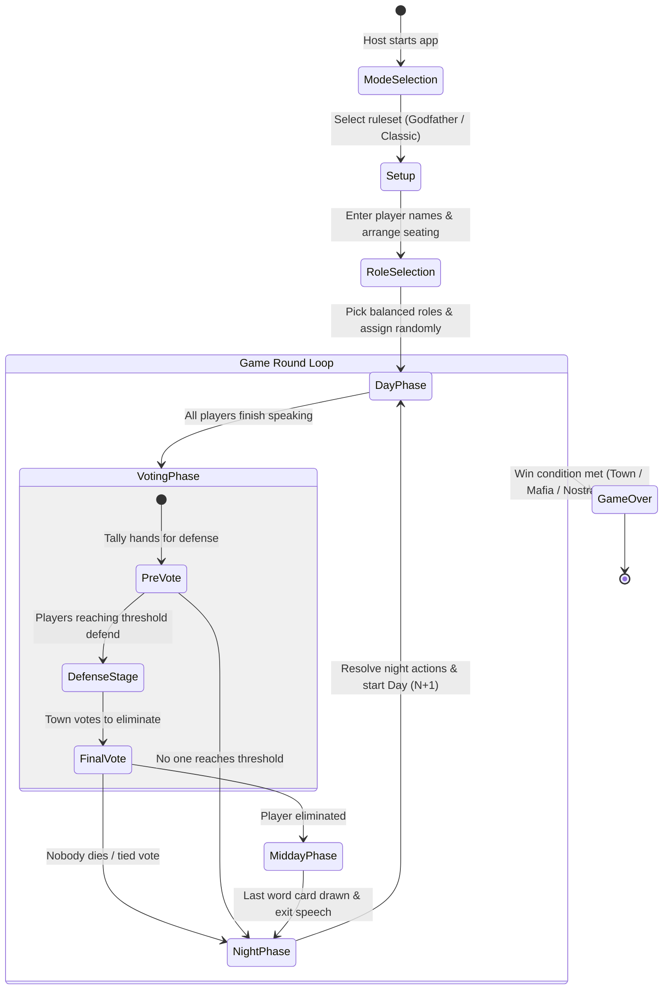

# How to Play & Game Flow Guide

This guide explains the complete game lifecycle of Mafia using the **Mafia Party Game Assistant (MPGA)**, tailored for human moderators, players, and AI systems.

---

## Game Lifecycle Overview

---

## 1. Pre-Game Setup Phases

### Step 1: Mode Selection
* Choose between **Godfather** or **Classic Mafia** modes.
* Modes dictate the default speaking time (e.g., 40s vs. 60s), defense time (60s), daily player turn shift, and voting threshold rounding rule (`ceil` or `half`).

### Step 2: Player Setup & Seating Order (Live Lobby or Manual Entry)
* **📱 Live Room Lobby Mode:**
  * The moderator creates a game room with an optional **Room PIN / Passcode** for access control.
  * Displays a live QR code and room join link on the moderator screen.
  * Players scan the QR code on their phones. If it's their first time, they enter their display name and tap **Join Lobby** (or if already saved, reconnect automatically). Players can edit their name directly inside the lobby and see the real-time roster of all joined players.
  * The moderator's roster updates in real-time as player devices connect and register their names (🟢).
  * The moderator can drag-and-drop player cards to match physical seating or remove players.
  * Once all players are in, the moderator clicks **Proceed to Role Selection**. When the game starts, all connected devices in the lobby automatically receive their secret role assignments.
* **⌨️ Manual Entry Mode:**
  * For offline games without player phones, the moderator types player names manually or loads demo rosters.
  * Drag and drop player names to match physical circular seating in the room.

### Step 3: Role Selection & Balancing
* Select the exact number of roles to match the player count.
* **Balance Validator:** The app checks the ratio of Mafia to Town. If the Mafia ratio exceeds mode limits (e.g., $> 34\%$), a balance warning is displayed before proceeding.
* **Random Assignment & Auto-Dispatch:** The app securely shuffles and assigns roles. Connected player phones immediately update to display their private role card with tap-to-reveal privacy shielding.

---

## 2. In-Game Phases (The Daily Cycle)

### Phase A: Day Phase (Speaking Turns & Challenges)
1. **Starting Speaker Shift:** Each new day, the first speaker shifts according to the game mode (`nextDayShift = 2` for Godfather, `1` for Classic).
2. **Direction:** The moderator selects **Clockwise** or **Counter-Clockwise** speaking flow.
3. **Timer Management:**
   * Each player receives their speaking timer (e.g., 40s).
   * The moderator can pause, resume, or fast-forward to the next speaker.
4. **Challenge Time Transfer (وقت چالش):**
   * While a speaker is talking, another player may ask to take challenge time.
   * Tapping **⚡ Challenge** opens the player selection modal. Only players who have not yet used challenge time today can be chosen.
   * The active speaker's remaining seconds are paused and saved.
   * The spotlight transfers to the challenger for their borrowed time (e.g., 25s).
   * Once the challenge finishes or is closed, the moderator clicks **Resume Speaker** and the original speaker finishes their remaining speech time.
5. Once all living players have spoken, the moderator proceeds to the **Voting Phase**.

### Phase B: Voting Phase
The voting phase consists of three structured stages:

1. **Stage 1 — Pre-Vote (Defense Qualification):**
   * The moderator calls for votes for each player in order.
   * Players raise their hands; the moderator inputs the vote counts.
   * Candidate vote counts are capped at $\max(0, N_{\text{alive}} - 1)$ to enforce the self-voting prohibition rule.
   * Any player whose vote count meets or exceeds the **Voting Threshold** ($\lceil \text{Alive} / 2 \rceil$) enters the Defense stage.
2. **Stage 2 — Defense Stage:**
   * Each qualified player receives a designated defense timer (typically 60s) to plead their case to the town.
3. **Stage 3 — Final Vote:**
   * The town votes on who among the defenders should be eliminated.
   * **Eyes-Closed Final Vote:** Depending on tournament rules, players may close their eyes to cast secret votes.
   * **Tie Breaker (Destiny Spin):** If two defenders receive equal top votes, a tie-breaker mechanic (or roulette) determines the outcome, or both survive.

### Phase C: Midday (*Nim-Rouz* / Last Word)
* When a player is eliminated in the vote:
  1. **Exit Speech:** The eliminated player is granted a brief final speech.
  2. **Last Word Card (کارت حرکت آخر):** The player draws a random card from the remaining "Last Word Deck" (e.g., revealing an alignment, silencing a player for tomorrow, or taking someone to defense). The drawn card is retired from the deck.

### Phase D: Night Phase (Abilities & Action Resolution)
1. **Sleep Call:** The town goes to sleep (all players close eyes).
2. **Step 0 — Night 1 Mafia Team Introduction:**
   * On Night 1, all living Mafia members wake up together silently to recognize their teammates. No shots or kills take place.
3. **Sequential Role Wake-Ups (Descending Priority Order):**
   * The moderator wakes up active roles one by one in standardized descending priority order ($99 > 90 > 80 > 70 > 50 > 10$).
   * **Two-Step Tactile Action UI:** For each active role, both the moderator cockpit and player mobile clients feature an intuitive two-step action flow:
     * **Step 1 (Select Action Type):** Tap explicit action buttons (e.g. `[🔫 Mafia Shot]` vs `[🚫 Pass Turn]` for Godfather; `[💉 Treat Teammate]`, `[🛡️ Self-Heal]`, or `[🚫 Pass]` for Doctor; `[🚫 Block Target]` vs `[🚫 Pass]` for Matador; `[🎯 Vigilante Shot]` vs `[🚫 Pass]` for Leon; `[✨ Revive]` for Constantine).
     * **Step 2 (Select Candidate Player):** Tap the target candidate from a dynamically filtered visual player card grid (e.g., self-only for Doctor emergency save, living opponents for shots/blocks/investigations, dead players for Constantine revive).
   * **Nostradamus (Night 1 only):** Selects up to 3 living players. The app calculates how many are Mafia, prompting the moderator to show the number on fingers. Nostradamus also secretly chooses their allegiance (Town or Mafia).
   * **Detective Inquiry:** When investigating a target, instant visual feedback (`👍 Guilty Mafia` / `👎 Innocent Town`) appears immediately on screen.
4. **Night Resolution Engine:** The app resolves all actions according to priority order, accounting for shields, blocks, saves, and Leon guilt penalties.
5. **Morning Report:** The moderator wakes the town, announces the night's public outcome (who died, or "Nobody died"), and advances to Day $N+1$.

---

## 3. Localization & Language Switcher

MPGA features full internationalization (i18n) with dedicated dictionaries for English and Persian (Farsi):
* **Language Switcher (`LanguageSwitcher.vue`):** A top-bar button lets users toggle instantly between **English (EN)** and **فارسی (FA)**.
* **Automatic RTL Layout:** Selecting Persian automatically sets `dir="rtl"` on the document, adapting margins, alignments, and text flow.
* **Pure Clean Dictionaries:** English translations are clean and natural; Persian translations provide authentic Iranian Mafia terms (*تیم مافیا*, *تیم شهروند*, *شب معارفه*, *وقت چالش*, *حرکت آخر*).
* **Persistent Preference:** Selected language is saved to `localStorage` and automatically restored on future visits.

---

## 4. Atmospheric Scenery & Visual Phase Art

Every phase is topped with an **Atmospheric Phase Scenery Banner** (`PhaseHeroBanner.vue`) providing immersive visual aesthetics:
* **Day:** Rising sun over city skyline (Golden Dawn).
* **Voting:** Scales of justice & courthouse pillars (Court of Truth).
* **Midday:** Hourglass & twilight horizon (Moment of Reflection).
* **Night:** Crescent moon, starry midnight sky & streetlamps (Midnight Intrigue).

---

## 5. Game Over & Victory Celebration

When a win condition is fulfilled:
1. **Celebration Fanfare:** The **Game Over Celebration Modal** (`GameOverModal.vue`) appears automatically with faction-themed fanfare, banners, and victory badges.
2. **Nostradamus Callout:** If Nostradamus predicted the winning faction correctly on Night 1, their co-victory is prominently celebrated.
3. **Survivor Roster:** All surviving players are showcased with their custom vector character artwork (`RoleAvatar.vue`).
4. **Match Analytics:** Summary tiles display total Doctor Saves, Detective Inquiries, Total Eliminations, and Match Duration (Days).
5. **Decisive Logs:** Highlights decisive turning points and actions from the match history.
6. **Non-Destructive Review:** The moderator can close the modal to review the final table state, inspect individual player statuses, or review historical logs via the top-bar button (`🏆 Match Ended`), or click **Start New Game** to reset and start fresh.

---

## 6. Dual-Transport Multiplayer (Connecting Player Phones)

Players can connect their mobile devices directly to the host's screen without installing any apps or registering accounts:

1. **Dual Transport Selection (Cloud Relay vs. WebRTC P2P):**
   * **☁️ Cloud Relay (Recommended):** Uses high-availability MQTT WebSockets (`broker.hivemq.com`). Delivers zero disconnects across mobile carrier 4G/5G, public Wi-Fi, and home routers. Includes real-time ping latency display.
   * **⚡ WebRTC P2P (Direct):** Direct browser-to-browser communication backed by STUN/TURN relays and 3s DataChannel keep-alives.
   * Moderators can toggle between modes in the lobby or host modal; QR codes and join URLs update automatically (`&t=cloud` or `&t=webrtc`).
2. **Host Pairing & Auto-Listening:**
   * The moderator screen automatically initializes a persistent host listening with a unique 4-character Room Code (e.g., `53FH`).
   * Clicking **📱 Connect Devices** in the top navigation bar opens the pairing modal displaying the live Room Code, a direct join link, an SVG QR code (`qrcode.vue`), live connection status, transport engine toggle, and a **🔄 New Code** button.
3. **Player Join & Simplified Seat Claiming:**
   * Players scan the QR code with their mobile phone cameras or navigate directly to `/?join=ROOM_CODE&t=cloud`.
   * **No Typing Needed:** Players can leave the name input blank and tap **Connect to Game**.
   * Upon connection, the phone immediately displays the host's seating roster (`#1 Ali`, `#2 Sarah`, `#3 John`, etc.).
   * Each player simply taps **"I am this player →"** on their name to claim their device seat and sync their private state.
4. **Secret Privacy Card:**
   * Players tap their personal blurred identity card to view their secret role and faction alignment in private.
5. **Live Synchronization:**
   * Player screens highlight the active speaker during the Day phase.
   * When their role wakes up during the Night phase, an interactive console lets them select their night ability target silently.
   * **Host Teleprompter Auto-Fill:** Player night choices stream straight to the moderator's console, auto-selecting the action and target with an audio chime and `📱 Mobile Device Synced` badge, while the moderator retains full manual click override capability.
   * Voting ballots allow players to record their votes directly on their phones.
6. **Mobile Ergonomics, WakeLock, Stealth OLED & Haptic Feedback:**
   * **Screen WakeLock API:** Automatically keeps player mobile screens awake during active play and night phases without dimming or locking (`🔆 / 🌙` header toggle).
   * **Stealth OLED Pitch-Black Night Mode:** Minimizes screen luminance with pitch-black backgrounds (`#000000`) and dimmed crimson tones to prevent facial glow from exposing night actors in dark rooms (`👁️ Stealth` toggle).
   * **Tactile Haptics:** Delivers distinct physical vibration cues to the player's palm for Night Call wake-ups, speaker spotlight warnings, and action/vote confirmations.
   * All mobile buttons, controls, and candidate cards feature tactile active touch states (`active:scale-95 active:brightness-90`) and meet accessibility standards ($\ge 44\text{px}$ touch targets).
   * Live latency badge displays real-time connection responsiveness (e.g., `🟢 42ms`).

---

## 7. In-Game Interactive Role Guide & Night Resolution Flowchart

Both the human moderator and mobile players can consult the comprehensive **In-Game Guide & Help System** anytime during setup or live gameplay by tapping the **📖 Guide** button in the top action bar:

1. **🎭 Role & Ability Hierarchy Tree:**
   * **Visual Hierarchy:** Displays custom SVG vector character artwork (`roleSvgMap`), faction alignment badges (🟢 Town, 🔴 Mafia, 🟣 Neutral), and narrative backstories.
   * **Abilities Breakdown ($a_1, a_2, \dots$):** Lists every active and passive ability, including action classification (Lethal Kill, Medical Save, Investigation, Role Block, Bribe, Revive, Armor Shield), standardized descending numerical priority ($99 \rightarrow 10$), charge limits, and targeting rules (self-targeting allowed vs. others only, living vs. dead).
   * **Tactical Pro-Tips:** Provides strategy guidance, edge-case tournament rulings, and synergies for both moderator adjudications and player decision-making.
   * **Dynamic Filters & Search:** Filter by "All Scenario Roles" or "Active Seated Roles in Current Match", by faction (Town, Mafia, Neutral), or via instant keyword search.

2. **🌙 Night Resolution Priority Ladder (Descending 99 → 0):**
   * Visual step-by-step ladder depicting the exact resolution sequence executed at dawn:
     * **Step 1 (Priority 99):** Passive Shields & Armor (Godfather vest, Nostradamus cloak).
     * **Step 2 (Priority 90):** Role Blocks & Bribes (Matador cancels actions, Saul Goodman buys citizen).
     * **Step 3 (Priority 80):** Doctor Save & Protection (Doctor heals target against fatal shots).
     * **Step 4 (Priority 70):** Lethal Night Shots (Godfather/Mafia and Leon fire; Leon innocent penalty verified).
     * **Step 5 (Priority 50):** Inquiries & Readings (Detective discovers faction; Nostradamus receives mafia count).
     * **Step 6 (Priority 10):** Constantine Revivals (Dead player restored to life).
     * **Step 7 (Sunrise / Dawn):** Moderator announces calculated actual eliminations.

3. **⚖️ Scenario & Tournament Rules:**
   * Summarizes active scenario parameters: default speaking time ($40\text{s} / 60\text{s}$), challenge time ($25\text{s} / 30\text{s}$), defense time ($60\text{s}$), and the mathematical defense threshold ($\lceil \text{Alive}/2 \rceil$).
   * Outlines fundamental rules including turn rotations ($+2$ shift), Godfather inquiry immunity, and Nostradamus win conditions.

---

## 8. Procedural Sound Effects & Audio Cues

MPGA features a zero-asset procedural sound engine powered by the Web Audio API:
* **Countdown Warning Ticks:** Cues players at $\le 10$ seconds and $\le 3$ seconds remaining on their speaking or defense turns.
* **Resonant Gong:** Signals when a speaking turn or defense timer reaches 0:00.
* **Night Fall & Dawn Rise Chimes:** Plays atmospheric sleep and wake-up chord progressions during night transitions.
* **Roulette Wheel Ticks:** Provides tactile audio feedback while spinning for tie-breakers and Last Word cards.
* **Victory Fanfare:** Triumphant fanfare upon game over and card draws.
* **Sound Toggle:** A dedicated mute button (🔊 / 🔇) in the top navigation bar allows silencing sound effects at any time.

