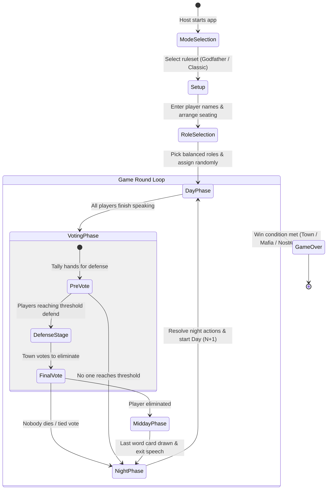

# How to Play & Game Flow Guide

This guide explains the complete game lifecycle of Mafia using the **Mafia Party Game Assistant (MPGA)**, tailored for human moderators, players, and AI systems.

---

## Game Lifecycle Overview

---

## 1. Pre-Game Setup Phases

### Step 1: Mode Selection
* Choose between **Godfather** or **Classic Mafia** modes.
* Modes dictate the default speaking time (e.g., 40s vs. 60s), defense time (60s), daily player turn shift, and voting threshold rounding rule (`ceil` or `half`).

### Step 2: Player Setup & Seating Order
* Add all participating players (minimum 4).
* **Physical Seating Arrangement:** Drag and drop player names to match their physical, circular seating order in the room. This ensures speaking turns and turn shifts mirror the real-life table correctly.

### Step 3: Role Selection & Balancing
* Select the exact number of roles to match the player count.
* **Balance Validator:** The app checks the ratio of Mafia to Town. If the Mafia ratio exceeds mode limits (e.g., $> 34\%$), a balance warning is displayed before proceeding.
* **Random Assignment:** The app securely shuffles and assigns roles to the seated players.

---

## 2. In-Game Phases (The Daily Cycle)

### Phase A: Day Phase (Speaking Turns)
1. **Starting Speaker Shift:** Each new day, the first speaker shifts according to the game mode (`nextDayShift = 2` for Godfather, `1` for Classic).
2. **Direction:** The moderator selects **Clockwise** or **Counter-Clockwise** speaking flow.
3. **Timer Management:**
   * Each player receives their speaking timer (e.g., 40s).
   * The moderator can pause, resume, or fast-forward to the next speaker.
   * Players may request "Challenge" time (interjections) as permitted by mode rules.
4. Once all living players have spoken, the moderator proceeds to the **Voting Phase**.

### Phase B: Voting Phase
The voting phase consists of three structured stages:

1. **Stage 1 — Pre-Vote (Defense Qualification):**
   * The moderator calls for votes for each player in order.
   * Players raise their hands; the moderator inputs the vote counts.
   * Any player whose vote count meets or exceeds the **Voting Threshold** ($\lceil \text{Alive} / 2 \rceil$) enters the Defense stage.
2. **Stage 2 — Defense Stage:**
   * Each qualified player receives a designated defense timer (typically 60s) to plead their case to the town.
3. **Stage 3 — Final Vote:**
   * The town votes on who among the defenders should be eliminated.
   * **Eyes-Closed Final Vote:** Depending on tournament rules, players may close their eyes to cast secret votes.
   * **Tie Breaker (Destiny Spin):** If two defenders receive equal top votes, a tie-breaker mechanic (or roulette) determines the outcome, or both survive.

### Phase C: Midday (*Nim-Rouz* / Last Word)
* When a player is eliminated in the vote:
  1. **Exit Speech:** The eliminated player is granted a brief final speech.
  2. **Last Word Card (کارت حرکت آخر):** The player draws a random card from the remaining "Last Word Deck" (e.g., revealing an alignment, silencing a player for tomorrow, or taking someone to defense). The drawn card is retired from the deck.

### Phase D: Night Phase (Abilities & Action Resolution)
1. **Sleep Call:** The town goes to sleep (all players close eyes).
2. **Sequential Wake-Ups:** The moderator wakes up active roles one by one in order:
   * **Godfather / Mafia:** Chooses a target for the night kill.
   * **Matador:** Selects a target to block.
   * **Doctor:** Selects a player to protect/treat.
   * **Detective:** Investigates a player (moderator confirms thumbs up/down).
   * **Leon (Vigilante):** Takes an optional town shot.
   * **Constantine:** Chooses whether to revive a dead player.
3. **Night Resolution Engine:** The app resolves all actions according to [priority order](rules.md#3-night-action-resolution--priority-engine), accounting for shields, blocks, and saves.
4. **Morning Report:** The moderator wakes the town, announces the night's public outcome (who died, or "Nobody died"), and advances to Day $N+1$.

---

## 3. Atmospheric Scenery & Visual Phase Art

Every phase is topped with an **Atmospheric Phase Scenery Banner** (`PhaseHeroBanner.vue`) providing immersive visual aesthetics:
* **Day:** Rising sun over city skyline (Golden Dawn).
* **Voting:** Scales of justice & courthouse pillars (Court of Truth).
* **Midday:** Hourglass & twilight horizon (Moment of Reflection).
* **Night:** Crescent moon, starry midnight sky & streetlamps (Midnight Intrigue).

---

## 4. Game Over & Victory Celebration

When a win condition is fulfilled:
1. **Celebration Fanfare:** The **Game Over Celebration Modal** (`GameOverModal.vue`) appears automatically with faction-themed fanfare, banners, and victory badges.
2. **Nostradamus Callout:** If Nostradamus predicted the winning faction correctly on Night 1, their co-victory is prominently celebrated.
3. **Survivor Roster:** All surviving players are showcased with their custom vector character artwork (`RoleAvatar.vue`).
4. **Match Analytics:** Summary tiles display total Doctor Saves, Detective Inquiries, Total Eliminations, and Match Duration (Days).
5. **Decisive Logs:** Highlights decisive turning points and actions from the match history.
6. **Non-Destructive Review:** The moderator can close the modal to review the final table state, inspect individual player statuses, or review historical logs via the top-bar button (`🏆 Match Ended`), or click **Start New Game** to reset and start fresh.

---

## 5. Serverless P2P Multiplayer (Connecting Player Phones)

Players can connect their mobile devices directly to the host's screen without installing any apps or registering accounts:

1. **Host Pairing:**
   * The moderator clicks the **📱 Connect Devices** button in the top navigation bar.
   * A dynamic modal presents a 4-character Room Code (e.g. `MPGA-A8F2`), a direct join link, and a QR code.
2. **Player Join & Seat Claim:**
   * Players scan the QR code with their mobile cameras or enter the room code at `/?join=MPGA-XXXX`.
   * Players select their name from the seating roster to claim their device seat.
3. **Secret Privacy Card:**
   * Players tap their personal blurred identity card to view their secret role and faction alignment in private.
4. **Live Synchronization:**
   * Player screens highlight the active speaker during the Day phase.
   * When their role wakes up during the Night phase, an interactive console lets them select their night ability target silently.
   * Voting ballots allow players to record their votes directly on their phones.

---

## 6. Procedural Sound Effects & Audio Cues

MPGA features a zero-asset procedural sound engine powered by the Web Audio API:
* **Countdown Warning Ticks:** Cues players at $\le 10$ seconds and $\le 3$ seconds remaining on their speaking or defense turns.
* **Resonant Gong:** Signals when a speaking turn or defense timer reaches 0:00.
* **Night Fall & Dawn Rise Chimes:** Plays atmospheric sleep and wake-up chord progressions during night transitions.
* **Roulette Wheel Ticks:** Provides tactile audio feedback while spinning for tie-breakers and Last Word cards.
* **Victory Fanfare:** Triumphant fanfare upon game over and card draws.
* **Sound Toggle:** A dedicated mute button (🔊 / 🔇) in the top navigation bar allows silencing sound effects at any time.
