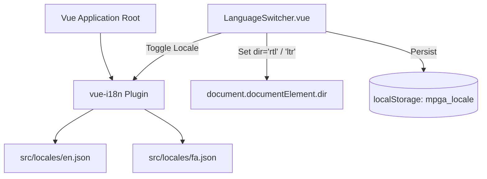

# Internationalization (i18n) & Localization Architecture

This document outlines the localization system, dictionary structure, dynamic RTL/LTR direction switching, and strict translation standards implemented in **Mafia Party Game Assistant (MPGA)**.

---

## 1. Supported Languages & Dictionaries

MPGA is fully localized in two primary languages using `vue-i18n`:

* **English (`en`):** `src/locales/en.json` (Source of truth for default strings and game terms).
* **Persian / Farsi (`fa`):** `src/locales/fa.json` (Authentic Iranian Mafia tournament terminology).



---

## 2. Core Principles & Rules

1. **Zero Hardcoded Strings:**
   * Never hardcode user-facing strings in Vue SFC templates (`<template>`), computed properties, or pinia stores.
   * Always use `$t('category.key')` or `$te('category.key')` in templates, or `i18n.global.t('category.key')` in JavaScript services.
2. **Pure & Unpolluted Translations:**
   * Avoid mixed parentheticals in dictionary values (e.g., do not write `"Doctor (پزشک)"` in the Persian dictionary; write `"پزشک"` directly).
3. **Symmetrical Key Structure:**
   * Every key present in `src/locales/en.json` **MUST** also exist with its accurate translation in `src/locales/fa.json`.
4. **Dynamic RTL/LTR Layout Direction:**
   * Switching to Persian automatically sets `document.documentElement.setAttribute('dir', 'rtl')`.
   * Switching to English automatically sets `document.documentElement.setAttribute('dir', 'ltr')`.
   * UI components should utilize logical Tailwind CSS classes (e.g. `start-`, `end-`, `text-start`, `text-end`) or symmetric flexbox alignments to ensure flawless rendering in both directions.

---

## 3. Key Nomenclature & Glossary (English vs Persian)

| English Term | Persian (Farsi) Term | Context / Usage |
| :--- | :--- | :--- |
| **Town** | تیم شهروند | Good alignment faction |
| **Mafia** | تیم مافیا | Evil alignment faction |
| **Nostradamus** | نوستراداموس | Neutral third-party predictor |
| **Leon (Vigilante)** | لئون (حرفه‌ای) | Town shooter with guilt penalty |
| **Doctor** | پزشک (دکتر) | Town protector |
| **Detective** | کارآگاه | Town investigator |
| **Godfather** | پدرخوانده | Mafia team leader |
| **Matador** | ماتادور | Mafia role blocker |
| **Silenced** | سکوت اجباری (سایلنت) | Player penalty preventing speaking |
| **Challenge Time** | وقت چالش | Speaking time granted to an opponent |
| **Last Word Card** | کارت حرکت آخر | Card drawn upon daytime elimination |
| **Introduction Night** | شب معارفه | First night where Mafia wake together |
| **Defense Stage** | مرحله دفاعیه | Time for accused players to defend |
| **Live Room Lobby** | لابی زنده اتاق | Interactive player connection lobby |
| **Cloud Relay** | رله ابری | High-stability MQTT WebSocket connection |
| **WebRTC P2P** | نظیر به نظیر (P2P) | Direct browser-to-browser connection |

---

## 4. How to Add New Localized Strings

1. Add the new entry under the appropriate namespace in `src/locales/en.json`:
   ```json
   "gameModerator": {
     "myNewFeature": "Activate Special Defense"
   }
   ```
2. Add the corresponding translation in `src/locales/fa.json`:
   ```json
   "gameModerator": {
     "myNewFeature": "فعال‌سازی دفاع ویژه"
   }
   ```
3. Use it in your component:
   ```html
   <button>{{ $t('gameModerator.myNewFeature') }}</button>
   ```
