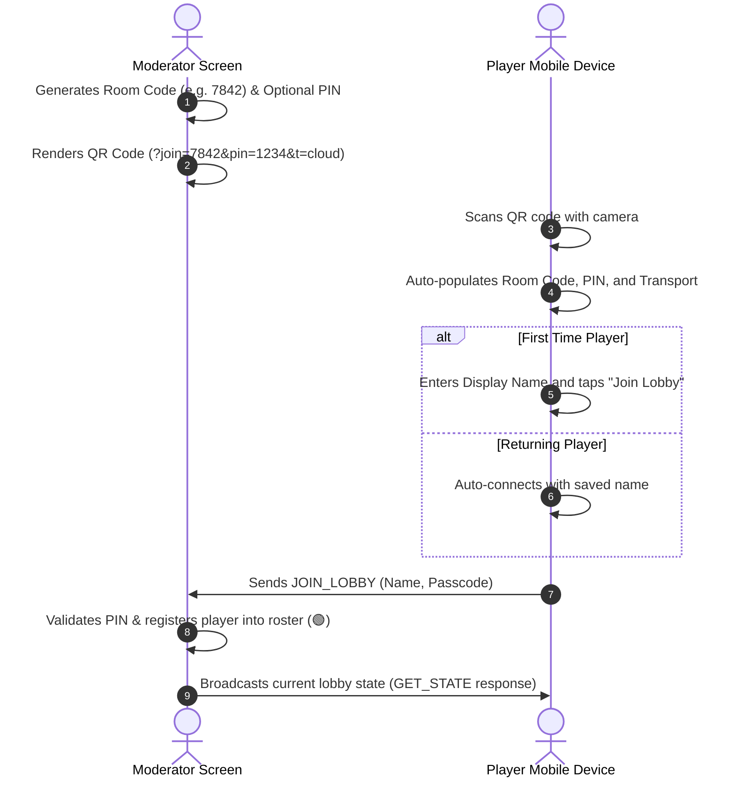

# Multiplayer Architecture & Protocols

This document details the architecture, transport protocols, room security, and synchronization mechanics powering the real-time multiplayer system in **Mafia Party Game Assistant (MPGA)**.

---

## 1. Dual-Transport Engine Architecture

MPGA features a modular **Dual-Transport Multiplayer Engine** (`useMultiplayerService.js`) designed to provide zero-friction local and remote connectivity across modern browsers and mobile devices.

```mermaid
graph TD
    subgraph Host / Moderator Cockpit
        HE[Host Engine Controller]
        HE -->|Transport Mode: Cloud| MQTT_H[MQTT Pub/Sub Host Client]
        HE -->|Transport Mode: WebRTC| RTC_H[WebRTC PeerJS Host Mesh]
        QR[QR Code Generator: &t=cloud or &t=webrtc]
    end

    subgraph Network Layer
        MQTT_H <-->|WSS Broker Pool HiveMQ / EMQX / Mosquitto| CLOUD_BROKER((Public MQTT Broker Pool))
        RTC_H <-->|STUN/TURN + DataChannels| P2P_NET((Direct WebRTC Channels))
    end

    subgraph Mobile Player Clients
        P1[Player 1 Device]
        P2[Player 2 Device]
        CLOUD_BROKER <-->|Topic: mpga/{roomCode}/*| P1
        P2P_NET <-->|Keep-Alive 3s DataChannel| P2
    end
```

### ☁️ Engine 1: Cloud Relay (MQTT over Secure WebSockets — Recommended)
* **Multi-Broker High-Availability Pool:** Dynamically connects across a resilient pool of public WSS brokers (`broker.hivemq.com:8884`, `broker.emqx.io:8084`, `test.mosquitto.org:8081`).
* **Automatic Failover & WebRTC Fallback:** If a broker experiences timeout or is blocked by local firewall policies, the engine automatically attempts the next broker in the pool before seamlessly falling back to direct WebRTC P2P.
* **Carrier CGNAT & Mobile 4G/5G Resilient:** Cellular data networks and restrictive corporate Wi-Fi firewalls often block direct P2P connections; Cloud Relay provides instant, reliable packet routing.
* **Pub/Sub Topic Isolation:**
  * Host broadcasts public state: `mpga/{roomCode}/public`
  * Host sends private role cards: `mpga/{roomCode}/client/{senderId}`
  * Clients send player actions & votes: `mpga/{roomCode}/host`
* **Real-Time Telemetry & Latency:** Continuous 3.5s ping/pong telemetry calculates round-trip ping (`pingLatency` in milliseconds) displayed live on mobile client headers.

### ⚡ Engine 2: Hardened WebRTC P2P (Direct)
* **100% Serverless:** Direct peer-to-peer data transmission using WebRTC DataChannels.
* **Fixed Room Code Persistence:** Eliminates room code mutation on temporary signaling reconnects (`unavailable-id` error handling).
* **3-Second Keep-Alive Pings:** Regular heartbeat packets prevent home routers and stateful firewalls from terminating idle peer data channels.
* **Public STUN Fallbacks:** Uses Google STUN servers (`stun.l.google.com:19302`) for NAT discovery.

---

## 2. Room Pairing, Passcodes & QR Code Flow



1. **Room Codes:** 4 to 6 character alphanumeric uppercase codes (e.g., `9N8J`, `7842`).
2. **Room PIN / Passcode:** An optional 4 to 8 character passcode configured by the moderator to prevent unauthorized room joins.
3. **URL Parameter Schema:**
   * `?join=ROOM_CODE` — Room code to connect to.
   * `&pin=PASSCODE` — Pre-filled room PIN.
   * `&t=cloud` or `&t=webrtc` — Desired transport engine.

---

## 3. Communication Protocol & Action Types

All messages exchanged between clients and the host are serialized JSON envelopes:

```json
{
  "type": "JOIN_LOBBY",
  "name": "Ali",
  "passcode": "1234",
  "senderId": "player-peer-xyz"
}
```

### Supported Action Types:

| Action Type | Direction | Payload Description |
| :--- | :--- | :--- |
| `GET_STATE` | Client $\to$ Host | Requests immediate broadcast of public state and setup roster upon initial connect. |
| `JOIN_LOBBY` | Client $\to$ Host | Player display name and passcode for registration in the pre-game lobby. |
| `CLAIM_SEAT` | Client $\to$ Host | Binds device peer ID to an existing seated player name. |
| `SYNC_FULL_STATE` | Host $\to$ Client | Broadcasts current phase, living player roster, day count, and public game status. |
| `ASSIGN_ROLE` | Host $\to$ Client | Direct private message delivering secret role details and abilities to a specific player. |
| `NIGHT_ACTION` | Client $\to$ Host | Submits secret night target (e.g., Doctor heal, Mafia shot, Detective inquiry). |
| `CAST_VOTE` | Client $\to$ Host | Submits vote against a candidate during the voting subphase (`voteType`: `'pre'` or `'final'`). Validated and deduplicated on host. |
| `CHALLENGE_REQUEST` | Client $\to$ Host | Requests challenge speaking time from the active day speaker. |
| `PING` / `PONG` | Both | Lightweight keep-alive and network roundtrip latency measurement. |

---

## 4. Privacy & Anti-Cheating Architecture

1. **Client-Side Obfuscation & Encrypted Local Storage:**
   * Secret roles are never embedded in the public broadcast payload (`SYNC_FULL_STATE`).
   * The host sends role payloads individually via direct private messages (`ASSIGN_ROLE`).
2. **Tap-to-Reveal Privacy Blur:**
   * Player screens initialize with an opaque frosted privacy shield (`🔒 Tap to Reveal Role`).
   * Players can tap once to inspect their secret role and tap again to immediately re-hide it from bystanders.
3. **Cryptographic & Ballot-Level Vote Deduplication:**
   * Voters cannot cast multiple votes or inflate counts by network packet spamming.
   * **Pre-Vote Stage:** Enforces at most 1 toggleable vote per candidate (`togglePreVote`). Voters cannot vote for themselves.
   * **Final Vote Stage:** Enforces at most 1 vote total across all defenders (`castFinalVote`), switching choices or retracting cleanly.
   * Dead players and self-voters are strictly filtered on both client and host.

---

## 5. Multi-Subscriber Action Bus & Reactive Presence Sync

1. **Decoupled Multi-Listener Event Bus:**
   * `useMultiplayerService` uses a multi-subscriber `Set` allowing simultaneous listeners across `App.vue` (global routing, lobby join, state sync), `NightPhase.vue` (live night actions), and `VotingPhase.vue` (live voting tallies).
   * Subscriptions return an unsubscription function (`const unsub = multiplayer.onPlayerAction(...)`) cleanly executed on Vue component unmount (`onUnmounted`).
2. **Reactive Peer Presence Tracking:**
   * Connected peers are registered immediately upon receiving any network packet (`GET_STATE`, `PING`, or `JOIN_LOBBY`) and tracked with reactive timestamped records.
   * `isPeerConnected(playerName)` and `connectedPlayerNames` provide immediate UI indicators in setup seating, moderator host modals, live lobby status bars, and live phase screens.
   * Inactive peers are automatically pruned after 35 seconds of silence with `PEERS_UPDATED` broadcasts to accommodate mobile background sleep throttling.
3. **Screen Sleep & Visibility Reconnection:**
   * When mobile clients wake from sleep or background tabs via `visibilitychange` or `online` network recovery, clients automatically re-establish broker connections and request state synchronization (`reconnectClient()`).

---

## 6. Mobile Player Ergonomics & Live Teleprompter Auto-Fill

1. **Host Teleprompter Auto-Fill (`NightPhase.vue`):**
   * As alive players secretly select their abilities on their personal mobile devices, `NIGHT_ACTION` events stream directly into the host teleprompter console.
   * The moderator's wizard UI automatically selects the action type and target in real-time, plays an audio notification chime, and renders a synchronized badge banner: `📱 Mobile Device Synced: [Player] selected [Target] (SYNCED)`.
   * The moderator retains 100% manual click override power at all times to correct or adjust selections.

2. **Screen WakeLock API (`useWakeLock.js`):**
   * Leverages the Screen Wake Lock API (`navigator.wakeLock.request('screen')`) to keep the player's mobile display awake during intense gameplay and night phases without requiring repeated screen taps.
   * Automatically releases on app exit or tab backgrounding and intelligently re-acquires upon tab visibility restoration (`visibilitychange`). Includes manual toggle switch in client header (`🔆 / 🌙`).

3. **Stealth OLED Pitch-Black Night Mode:**
   * Eliminates room luminescence in dark party environments where screen glow could betray a player's role during night calls.
   * Automatically activates pure pitch-black backgrounds (`#000000`), dimmed charcoal containers, and muted crimson accents. Includes an instant toggle button (`👁️ Stealth`) in the client header.

4. **Tactile Haptic Vibration Cues (`useHaptics.js`):**
   * Delivers silent, physical feedback directly to the player's hand via `navigator.vibrate`:
     * **Night Call Wakeup:** Distinct double pulse (`[120ms, 80ms, 120ms]`) prompting players to open their eyes and submit actions silently.
     * **Active Speaker / Warning Pulse:** Triple alert pulse (`[100ms, 50ms, 100ms, 50ms, 150ms]`) alerting a player when their turn or challenge begins.
     * **Action & Vote Confirmation:** Crisp tactile confirmation clicks (`40ms` / `60ms`).


