# Project Roadmap & Future Todos

This document tracks completed milestones, current capabilities, and upcoming features for the **Mafia Party Game Assistant (MPGA)**.

---

## Architecture Evolution

```mermaid
graph TD
    subgraph Core Architecture Completed
        A[Vue 3 Orchestrator: App.vue] --> B[ModeSelection.vue]
        A --> C[PlayerEntry.vue]
        A --> D[RoleSelection.vue]
        A --> E[GameModerator.vue]
        E --> F1[DayPhase.vue: Spotlight Wizard & Hero Banner]
        E --> F2[VotingPhase.vue: Pre-Vote & Defense Wizard]
        E --> F3[MiddayPhase.vue: Exit Speech & Last Word Deck]
        E --> F4[NightPhase.vue: Teleprompter Wizard]
        E --> H[PlayerStatusModal.vue: Anytime Overrides]
        E --> I[GameLogDrawer.vue: Historical Timeline]
        E --> GO[GameOverModal.vue: Victory Fanfare & Match Analytics]
        E -.-> WC[useWinCondition: Automatic Win Engine]
        E -.-> G[(LocalStorage Base64 Sync)]
    end

    subgraph Phase 2 : Serverless P2P Multiplayer
        J[Moderator Host Client] -->|Generates Session & Room ID| K[QR Code / Join Link]
        L1[Player Phone 1] -->|Scans QR / Connects| M((WebRTC P2P Data Channels))
        L2[Player Phone 2] -->|Scans QR / Connects| M
        J <-->|Master State & Validation| M
        M <-->|Private Role Info & Prompts| L1
        M <-->|Private Role Info & Prompts| L2
    end
```

---

## ✅ Completed Milestones

### 1. Anytime Moderator State Overrides & Player Management
* Added quick Kill/Revive actions on all seated players in the live dashboard.
* Added [`PlayerStatusModal.vue`](file:///Users/ali.heristchian/Documents/learning/mpga/src/components/PlayerStatusModal.vue) allowing the moderator to adjust living/dead state, issue warning cards, apply silence penalties, and log custom/preset reasons.

### 2. Centralized Game Action & Historical Event Logging
* Added persistent logging engine in [`gameStore.js`](file:///Users/ali.heristchian/Documents/learning/mpga/src/stores/gameStore.js) recording all speaker turns, challenges, pre-vote qualifications, final votes, tie-breaks, night targets, shields, blocks, saves, revives, and moderator overrides.
* Added sliding [`GameLogDrawer.vue`](file:///Users/ali.heristchian/Documents/learning/mpga/src/components/GameLogDrawer.vue) allowing the moderator to review past events filtered by Day, Phase, or player name.

### 3. Step-by-Step Guided Phase Wizards
* **Day Phase (`DayPhase.vue`):** Flow setup with direction shift $\rightarrow$ single-speaker spotlight countdown timer $\rightarrow$ challenge bonus time $\rightarrow$ wrap-up.
* **Voting Phase (`VotingPhase.vue`):** Interactive pre-vote tally with automatic threshold indicator ($\lceil \text{Alive}/2 \rceil$) $\rightarrow$ sequential defender countdown timers $\rightarrow$ closed-eye final vote $\rightarrow$ Destiny Spin tie-breaker.
* **Midday Phase (`MiddayPhase.vue`):** Exit speech countdown $\rightarrow$ animated Last Word Card draw roulette with deck retirement.
* **Night Phase (`NightPhase.vue`):** Sleep town call $\rightarrow$ step-by-step role wakeup teleprompter wizard with instant detective inquiry feedback $\rightarrow$ priority engine resolution $\rightarrow$ morning announcement script.

### 4. Atmospheric Visual Theming & Character Art System
* Implemented distinct color themes and ambient styling for Day (Solar Amber), Voting (Courtroom Crimson), Midday (Twilight Purple), and Night (Midnight Indigo).
* Created [`PhaseHeroBanner.vue`](file:///Users/ali.heristchian/Documents/learning/mpga/src/components/PhaseHeroBanner.vue) with vector SVG scenery for all sub-phases.
* Created [`roleIllustrations.js`](file:///Users/ali.heristchian/Documents/learning/mpga/src/data/roleIllustrations.js) with scalable SVG vector character artwork for all 9 game roles.
* Enhanced [`RoleAvatar.vue`](file:///Users/ali.heristchian/Documents/learning/mpga/src/components/RoleAvatar.vue) with scalable vector graphics, faction borders, and death state grayscale filters.

### 5. Automatic Win Condition Engine & Victory Celebration Modal
* Implemented pure evaluation service [`useWinCondition.js`](file:///Users/ali.heristchian/Documents/learning/mpga/src/services/useWinCondition.js) automatically checking Town victory (`livingMafia === 0`), Mafia parity victory (`livingMafia >= livingTown`), and Nostradamus co-victory.
* Created [`GameOverModal.vue`](file:///Users/ali.heristchian/Documents/learning/mpga/src/components/GameOverModal.vue) featuring victory fanfare, survivor roster with character art, match metrics summary tiles (Doctor saves, Detective inquiries, total eliminations, total match days), and decisive timeline highlights.
* Embedded non-destructive board inspection with top-bar victory badge in [`GameModerator.vue`](file:///Users/ali.heristchian/Documents/learning/mpga/src/components/GameModerator.vue).

### 6. Voting Limits & Rule Bounds Engine
* Created [`useVotingService.js`](file:///Users/ali.heristchian/Documents/learning/mpga/src/services/useVotingService.js) enforcing standard Mafia voting constraints (self-voting prohibition bounding votes per candidate to $\max(0, N_{\text{alive}} - 1)$).
* Enforced UI bounds and disabled state for pre-vote qualification and closed-eye final vote counters.
* Full test coverage with 7 dedicated unit tests in [`useVotingService.spec.js`](file:///Users/ali.heristchian/Documents/learning/mpga/src/services/useVotingService.spec.js).

### 7. Serverless P2P Multiplayer & Mobile Player Client
* Built using `PeerJS` over WebRTC direct data channels without backend servers.
* **Resilient Infrastructure:** Backed by Google STUN servers, OpenRelay TURN relays (`openrelay.metered.ca`), 20-second heartbeat keep-alives, and auto-reconnection handlers.
* **Host Pairing (`MultiplayerHostModal.vue`):** Generates 4-character Room ID, direct join URL, and sharp SVG QR code (`qrcode.vue`) with connected device indicators, host signaling status badge, and code regeneration.
* **Privacy-First Mobile Client (`PlayerClient.vue`):** Standalone mobile interface with visual roster seat claiming, tap-to-reveal secret role card, live speaker spotlight synchronization, night action console with real-time detective inquiry feedback, voting ballots, and timeout/retry recovery actions.
* **Strict Payload Sanitization:** `sanitizePlayerPayload` and `sanitizePublicGameState` ensure zero role leakage to foreign player clients.

### 8. Web Audio Procedural Sound Engine
* Implemented zero-asset Web Audio API tone synthesis in [`useAudioService.js`](file:///Users/ali.heristchian/Documents/learning/mpga/src/services/useAudioService.js).
* Synthesizes countdown warning ticks ($\le 10$s, $\le 3$s), resonant end-of-turn gongs, night fall & dawn rise chord progressions, roulette wheel mechanical ticks, and victory fanfares.
* Global sound mute toggle with persistence to `localStorage`.

---

## 🚀 Upcoming Milestones

### 1. Offline PWA (Progressive Web App) & Service Worker Support
**Goal:** Enable complete offline playability and home screen installability on mobile devices and tablets during tournaments with intermittent connectivity.
* Add web app manifest, custom icons, and Workbox caching for all assets.

### 2. Audio Customization & Thematic Soundpacks
**Goal:** Allow hosts to select alternative sound packs or customize tone frequencies and timer thresholds.

### 3. Tournament Bracket & Multi-Table Management
**Goal:** Support tournament organizers managing multi-table events with master standings and aggregated player statistics.

### 4. Technical Debt: TypeScript Migration
* Migrate from Vanilla JS to **TypeScript** (`<script setup lang="ts">`).
* Define strict TypeScript interfaces (`Player`, `Role`, `Ability`, `GameMode`, `NightAction`, `GameEventLog`, `LastWordCard`, `GameStatusResult`).
