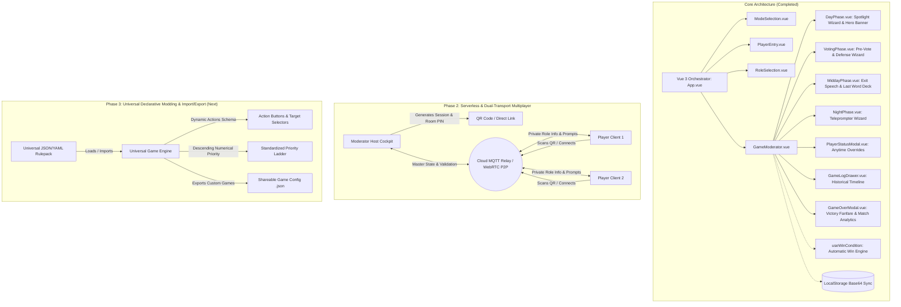

# Project Roadmap & Future Architecture

This document tracks completed milestones, current capabilities, and upcoming architectural evolutions for the **Mafia Party Game Assistant (MPGA)**.

---

## 🏛️ Architecture Evolution

---

## ✅ Completed Milestones

### 1. Anytime Moderator State Overrides & Player Management
* Added quick Kill/Revive actions on all seated players in the live dashboard.
* Added [`PlayerStatusModal.vue`](file:///Users/ali.heristchian/Documents/learning/mpga/src/components/PlayerStatusModal.vue) allowing the moderator to adjust living/dead state, issue warning cards, apply silence penalties, and log custom/preset reasons.

### 2. Centralized Game Action & Historical Event Logging
* Added persistent logging engine in [`gameStore.js`](file:///Users/ali.heristchian/Documents/learning/mpga/src/stores/gameStore.js) recording all speaker turns, challenges, pre-vote qualifications, final votes, tie-breaks, night targets, shields, blocks, saves, revives, and moderator overrides.
* Added sliding [`GameLogDrawer.vue`](file:///Users/ali.heristchian/Documents/learning/mpga/src/components/GameLogDrawer.vue) allowing the moderator to review past events filtered by Day, Phase, or player name.

### 3. Step-by-Step Guided Phase Wizards
* **Day Phase (`DayPhase.vue`):** Flow setup with direction shift $\rightarrow$ single-speaker spotlight countdown timer $\rightarrow$ challenge bonus time $\rightarrow$ wrap-up.
* **Voting Phase (`VotingPhase.vue`):** Interactive pre-vote tally with automatic threshold indicator ($\lceil \text{Alive}/2 \rceil$) $\rightarrow$ sequential defender countdown timers $\rightarrow$ closed-eye final vote $\rightarrow$ Destiny Spin tie-breaker.
* **Midday Phase (`MiddayPhase.vue`):** Exit speech countdown $\rightarrow$ animated Last Word Card draw roulette with deck retirement.
* **Night Phase (`NightPhase.vue`):** Sleep town call $\rightarrow$ step-by-step role wakeup teleprompter wizard with instant detective inquiry feedback $\rightarrow$ priority engine resolution $\rightarrow$ morning announcement script.

### 4. Atmospheric Visual Theming & Character Art System
* Implemented distinct color themes and ambient styling for Day (Solar Amber), Voting (Courtroom Crimson), Midday (Twilight Purple), and Night (Midnight Indigo).
* Created [`PhaseHeroBanner.vue`](file:///Users/ali.heristchian/Documents/learning/mpga/src/components/PhaseHeroBanner.vue) with vector SVG scenery for all sub-phases.
* Created [`roleIllustrations.js`](file:///Users/ali.heristchian/Documents/learning/mpga/src/data/roleIllustrations.js) with scalable SVG vector character artwork for all 9 game roles.
* Enhanced [`RoleAvatar.vue`](file:///Users/ali.heristchian/Documents/learning/mpga/src/components/RoleAvatar.vue) with scalable vector graphics, faction borders, and death state grayscale filters.

### 5. Automatic Win Condition Engine & Victory Celebration Modal
* Implemented pure evaluation service [`useWinCondition.js`](file:///Users/ali.heristchian/Documents/learning/mpga/src/services/useWinCondition.js) automatically checking Town victory (`livingMafia === 0`), Mafia parity victory (`livingMafia >= livingTown`), and Nostradamus co-victory.
* Created [`GameOverModal.vue`](file:///Users/ali.heristchian/Documents/learning/mpga/src/components/GameOverModal.vue) featuring victory fanfare, survivor roster with character art, match metrics summary tiles (Doctor saves, Detective inquiries, total eliminations, total match days), and decisive timeline highlights.
* Embedded non-destructive board inspection with top-bar victory badge in [`GameModerator.vue`](file:///Users/ali.heristchian/Documents/learning/mpga/src/components/GameModerator.vue).

### 6. Voting Limits & Rule Bounds Engine
* Created [`useVotingService.js`](file:///Users/ali.heristchian/Documents/learning/mpga/src/services/useVotingService.js) enforcing standard Mafia voting constraints (self-voting prohibition bounding votes per candidate to $\max(0, N_{\text{alive}} - 1)$).
* Enforced UI bounds and disabled state for pre-vote qualification and closed-eye final vote counters.
* Full test coverage with 7 dedicated unit tests in [`useVotingService.spec.js`](file:///Users/ali.heristchian/Documents/learning/mpga/src/services/useVotingService.spec.js).

### 7. Serverless P2P Multiplayer & Mobile Player Client
* Built using `PeerJS` over WebRTC direct data channels without backend servers.
* **Resilient Infrastructure:** Backed by Google STUN servers, OpenRelay TURN relays (`openrelay.metered.ca`), 20-second heartbeat keep-alives, and auto-reconnection handlers.
* **Host Pairing (`MultiplayerHostModal.vue`):** Generates 4-character Room ID, direct join URL, and sharp SVG QR code (`qrcode.vue`) with connected device indicators, host signaling status badge, and code regeneration.
* **Privacy-First Mobile Client (`PlayerClient.vue`):** Standalone mobile interface with visual roster seat claiming, tap-to-reveal secret role card, live speaker spotlight synchronization, night action console with real-time detective inquiry feedback, voting ballots, and timeout/retry recovery actions.
* **Strict Payload Sanitization:** `sanitizePlayerPayload` and `sanitizePublicGameState` ensure zero role leakage to foreign player clients.

### 8. Web Audio Procedural Sound Engine & CDN Soundtrack Integration
* Synthesizes countdown warning ticks ($\le 10$s, $\le 3$s), resonant end-of-turn gongs, night fall & dawn rise chord progressions, roulette wheel mechanical ticks, and victory fanfares.
* Added phase-based custom soundtrack engine streaming orchestral audio stems (originally composed via Suno AI) directly from GitHub Release CDN assets.

### 9. Persian Localization, Language Switcher & Tournament Rule Polish
* **Pure Bilingual Architecture:** Added comprehensive Persian translation dictionary ([`src/locales/fa.json`](file:///Users/ali.heristchian/Documents/learning/mpga/src/locales/fa.json)) and cleaned English dictionary ([`src/locales/en.json`](file:///Users/ali.heristchian/Documents/learning/mpga/src/locales/en.json)), removing mixed parenthetical terms.
* **Dynamic Language Switcher (`LanguageSwitcher.vue`):** Instant EN / FA toggle with automatic document RTL/LTR layout switching and `localStorage` persistence.
* **Day Challenge Transfer System (`DayPhase.vue`):** Active speaker timer pause, spotlight handoff to challenger for borrowed time (`borrowedTimeToTalk`), single-challenge daily quota enforcement, and speaker resume.
* **Night 1 Mafia Introduction (`NightPhase.vue`):** Dedicated silent team familiarization step on Night 1 before individual role wake-ups.
* **Leon Guilt Penalty Resolution (`gameEngine.js`):** Leon shooting Town kills Leon at sunrise while sparing the Town target; Leon shooting Mafia eliminates the Mafia player.
* **Nostradamus 3-Player Inquiry (`NightPhase.vue`):** Multi-target selection with live Mafia count calculation and silent finger-signal cue.
* **Self-Targeting Guardrails:** Blocked self-targeting for Leon, Detective, Godfather, Matador, and Saul Goodman (Doctor self-target allowed).

### 10. Live Player Lobby, Room PIN Passcode & Automated Role Reveal
* **Live Room Lobby Setup (`PlayerEntry.vue`):** Host can generate a Room PIN passcode and display dynamic QR codes. Player phones join the lobby with their name and PIN, automatically populating the moderator roster in real time.
* **Drag-and-Drop Seating & Management:** Moderator can re-order players via HTML5 drag-and-drop to match the physical circle or remove disconnected peers.
* **Dedicated Mobile Lobby Screen (`PlayerClient.vue`):** Clean waiting room UI displaying room code, player's name, pulsing host-wait status, and a live roster of peers who joined the lobby.
* **Seamless Role Auto-Dispatch:** Once the moderator assigns roles and starts the game, connected player phones in the lobby instantly transition to their secret role reveal cards with privacy shielding.

### 12. Two-Step Action UX & Standardized Descending Priority Engine
* **Two-Step Action Selection:** Replaced raw single-target dropdowns with explicit, labeled action buttons (`[🔫 Direct Shot]`, `[💉 Protect Ally]`, `[🛡️ Self Heal]`, `[🔍 Investigate]`, `[🚫 Pass]`) across moderator teleprompter and mobile player clients.
* **Standardized Descending Numerical Priority ($99 > 90 > 80 > 70 > 50 > 10$):** Unifed night action resolution sequence with mathematical determinism in `abilities.js` and `gameEngine.js`.
* **Dynamic Candidate Filtering:** Target rosters dynamically filter candidates according to active ability constraints (self-target rules, dead/alive constraints, multi-target quotas).

### 13. Cloud CDN Soundtrack Engine & Audio Player Console
* **Direct High-Speed CDN Streaming:** Complete MPGA soundtrack suite composed by Ali Heristchian hosted directly on GitHub Releases CDN assets with zero local binary repo bloat.
* **Phase-Aware Audio Management:** Dynamic background music rotation per game phase (Lobby, Day, Night, Voting, Midday, Victory) with smooth crossfading and auto-DJ capabilities.
* **Streamlined Soundtrack Console (`SoundtrackConsole.vue`):** Interactive modal for playing, pausing, track skipping, volume control, auto-play toggling, and phase playlist browsing.

### 14. In-App Interactive Role & Ability Guide (`GameGuideModal.vue`)
* **Interactive Faction Taxonomy:** Visual hierarchy categorized by Town 🟢, Mafia 🔴, and Neutral/Third-Party 🟣.
* **Detailed Ability Matrix:** Breakdown of active and passive abilities ($a_1, a_2, \dots$), priority tiers, target constraints, character lore, and tournament advice.
* **Bilingual In-Game Access:** Accessible via top-bar `[❓ Guide]` icon on both moderator cockpit and mobile player screens with secret role shielding.

### 15. Live Teleprompter Auto-Fill, Screen WakeLock, Stealth OLED & Haptics
* **Direct Mobile Actions $\to$ Teleprompter Auto-Fill (`NightPhase.vue`):** Player night choices stream live into the host teleprompter console, auto-populating action type and target with an audio chime and `📱 Mobile Device Synced` badge, backed by 100% moderator manual override capability.
* **Screen WakeLock API (`useWakeLock.js`):** Keeps player and host screens awake without dimming, automatically releasing on background/exit and re-acquiring on visibility restoration.
* **Stealth OLED Pitch-Black Night Mode (`PlayerClient.vue`):** Pure pitch-black UI (`#000000`) and low-luminescence muted crimson styling preventing ambient facial glow in dark party rooms during night turns.
* **Tactile Haptic Vibration System (`useHaptics.js`):** Multi-pattern tactile feedback delivering silent physical pulses for Night Call wake-ups, speaker spotlight warnings, and action/vote confirmations.

### 14. PWA Offline Engine, 1-Step Undo, Voice Narration & Spectator Ecosystem
* **Progressive Web App (PWA) & Service Worker:** Full offline capability with standalone web app manifest (`manifest.json`), asset pre-caching, and stale-while-revalidate fetch strategy (`sw.js`).
* **1-Step Undo / Moderator Rewind:** In-memory reactive state snapshot stack in `gameStore.js` enabling immediate rollback for accidental eliminations, penalty cards, Nostradamus picks, or phase shifts with live peer broadcast sync.
* **Automated TTS Voice Narration (`useVoiceNarration.js`):** Browser-native Web Speech API synthesizing bilingual narrator cues in Persian (`fa-IR`) and English (`en-US`) for sleeping calls, role wakeups, and dawn announcements.
* **Post-Match Shareable Story Card (`MatchStoryCardModal.vue`):** Client-side HTML5 Canvas generating crisp 9:16 vertical 1080x1920 social cards featuring match stats, victory banners, survivor badges, and instant Web Share API dispatch.
* **Big-Screen Projector / TV View (`ProjectorView.vue`):** Dedicated television and cafe projector display (`?view=projector`) showing active speaker spotlight countdown, live vote tallies, and atmospheric stealth scenery while strictly protecting secret role privacy.
* **Post-Match Time-Travel Replay (`useMatchReplay.js` & `MatchReplayModal.vue`):** Interactive timeline scrubber reconstructing the entire match step-by-step with simulated seating roster highlights, auto-playback, and speed controls.

### 16. Full TypeScript Migration (v2.0.0 Major Milestone)
* **100% Strict Type Safety:** Root `tsconfig.json`, domain models in `src/types/`, typed Pinia stores, typed composable services, typed utils, and `<script setup lang="ts">` across all 23 Vue 3 Single File Components.
* **Zero Legacy JavaScript:** Full replacement of `.js` files with `.ts`, complete type safety on P2P/MQTT networking packets, game engine night actions, and voting states.
* **Comprehensive Test Suite Parity:** All 11 unit test suites converted to `.spec.ts` with 100% pass rate (67/67 tests) in Vitest.

---

## 🚀 Upcoming Roadmap & Master TODOs

### 📱 1. Multiplayer & Mobile Experience
- [x] **Direct Player Actions → Host Teleprompter:** Connected players submit night ability targets and daytime voting ballots directly from smartphones; choices stream live into the moderator teleprompter with manual override controls.
- [x] **Multiplayer Presence Healing & Auto-Heartbeat:** Continuous ping/pong health checks, reactive connection status badges, and automatic reconnection handling across Cloud MQTT and WebRTC.
- [x] **Spectator / Projector Big-Screen View (`?view=projector`):** Dedicated television and cafe projector display showing active speaker spotlight countdown, live vote tallies, and phase scenery without exposing secret roles or moderator controls.
- [x] **Screen WakeLock API (`navigator.wakeLock`):** Prevents player and moderator phone displays from dimming or sleeping during active speaker turns and defense timers.
- [x] **Tactile Haptic Feedback (`navigator.vibrate`):** Silent vibration cues on speaking turn start, 5-second defense warning, and night phase wake-ups.
- [x] **Stealth OLED Night Mode:** Ultra-low luminescence pitch-black interface to eliminate face illumination and prevent physical room tells during the night phase.
- [x] **Progressive Web App (PWA) & Offline Cache:** "Add to Home Screen" support on iOS/Android with Workbox service worker caching for low-connectivity venues.

### 🧠 2. Game Engine & Modding Architecture
- [ ] **100% Declarative Config Engine:** Eliminate hardcoded role logic in favor of declarative action schemas (`actions`, `passives`, `inquiryResponse`, `priorityLadder`).
- [ ] **Game Pack Import / Export (.json / .yaml):** One-click import and export of community-created tournament rulepacks, custom roles, and house rules.
- [ ] **In-Browser Visual "Role Studio":** GUI creator to design custom characters, abilities, SVG icons, and faction alignments without editing code.
- [x] **1-Step Undo / Moderator Misclick Rewind:** Fast rollback button allowing the moderator to undo accidental eliminations or premature phase advances.
- [x] **Post-Match Time-Travel Replay:** Interactive step-by-step match timeline scrubber to replay every turn, vote, and night ability after match completion.

### 🏆 3. Tournament & Competitive League Features
- [ ] **Tournament Bracket & Multi-Table League Management:** Master standings, table rotations, point accumulation, and match scoring across multi-table tournaments.
- [x] **Post-Match Social Infographics:** Canvas-rendered summary story cards (MVP, decisive doctor saves, key night actions) ready to export for Instagram/WhatsApp.
- [ ] **Automated Multi-Device E2E Simulation (Playwright):** CI simulation testing 1 host + 10 virtual player browser clients playing through complete matches.

### 🎙️ 4. Audio & Code Quality
- [x] **TTS Voice Narration (Web Speech API):** Optional automated speech synthesis reading the night teleprompter announcements and speaker warnings.
- [x] **TypeScript 5+ Strict Migration (v2.0.0):** Added `<script setup lang="ts">` and strict interfaces across all Pinia stores, composables, and components.

