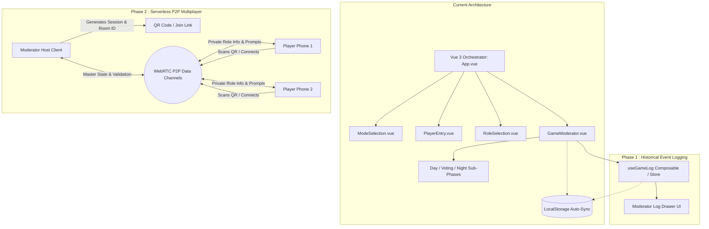

# Project Roadmap & Future Todos

This document tracks planned architecture milestones, feature enhancements, and technical debt tasks for the **Mafia Party Game Assistant (MPGA)**.

---

## Architecture Evolution

---

## Upcoming Milestones

### 1. Centralized Action & Event Logging
**Goal:** Provide the moderator with a complete, searchable timeline of all in-game actions and phase transitions.
* **Implementation:** Create a dedicated composable ([`useGameLog.js`](file:///Users/ali.heristchian/Documents/learning/mpga/src/services/useGameLog.js)) and Pinia log store.
* **Tracked Events:**
  * Day Phase: Speaker turns, challenge time usage, elapsed speaking seconds.
  * Voting Phase: Pre-vote tallies, defenders qualified, final votes, tie-break results.
  * Night Phase: Ability choices (targets selected), blocks, saves, and death causes.
* **UI:** Collapsible sliding sidebar / event drawer on the moderator board.
* **Persistence:** Serialized into `localStorage` alongside active game state.

### 2. Serverless P2P Multiplayer (WebRTC / PeerJS)
**Goal:** Enable players to join the moderator's session from their personal mobile devices without requiring an expensive backend server or database.
* **Technology:** WebRTC data channels via `PeerJS` or raw WebRTC signaling.
* **Workflow:**
  1. Moderator creates game $\rightarrow$ App generates unique Room ID & QR Code (via `qrcode.vue`).
  2. Players scan the QR code with their mobile browsers.
  3. Direct P2P data channels establish between the Moderator (Host) and connected Player devices.
  4. The Moderator device maintains authoritative master state; disconnected players can be operated manually by the moderator.

### 3. Restricted Player Client View
**Goal:** Deliver a privacy-focused mobile interface for connected players.
* **Data Isolation:** Host only transmits the player's personal role, ability prompts when active, and voting ballot. Full game state (other roles, night targets) is never leaked over the wire.
* **Interactions:**
  * View private role description and active night ability.
  * Submit night ability target selections directly from mobile device.
  * Cast votes during Day/Voting phases.

---

## Future Todos & Immediate Enhancements

### 1. 🚨 Architecture Fix: Harmonize Component-Store Contracts
* **Problem:** Currently, [`DayPhase.vue`](file:///Users/ali.heristchian/Documents/learning/mpga/src/components/game/DayPhase.vue) and [`VotingPhase.vue`](file:///Users/ali.heristchian/Documents/learning/mpga/src/components/game/VotingPhase.vue) define local props and custom emits that [`GameModerator.vue`](file:///Users/ali.heristchian/Documents/learning/mpga/src/components/GameModerator.vue) does not bind.
* **Solution:** Refactor all phase components to interface directly with [`useGameStore`](file:///Users/ali.heristchian/Documents/learning/mpga/src/stores/gameStore.js) for phase transitions and player state updates.

### 2. 🎛️ Moderator Cockpit (Day Phase UI Refinement)
* **All-Player Overview:** Replace single-player isolated timer cards with a **circular or grid live dashboard** showing all seated players, active speaker indicators, remaining times, and challenge count badges.
* **Flexible Speaker Switching:** Allow the moderator to jump between speakers, award borrowed/challenge time on the fly, and apply penalty cards.
* **Dynamic Table Reordering:** Enable live drag-and-drop seating adjustments if players physically swap seats during the game.

### 3. 🗳️ Enhanced Multi-Stage Voting & Closed-Eye Protocol
* **Pre-Vote Stage:** Automatic visual indicator when a player meets or exceeds the required threshold ($\lceil \text{Alive} / 2 \rceil$).
* **Defense Stage:** Sequential individual defense countdown timers for each defender.
* **Closed-Eye Final Vote:** Dedicated UI step where the moderator directs town players to close their eyes while counting final votes.
* **Tie-Breaker Roulette:** Smooth animated Destiny Spin with configurable outcomes.

### 4. 🃏 Midday Phase & Last Word Cards Deck (Nim-Rouz / کارت حرکت آخر)
* **Midday Sub-Phase:** Introduce `midday` in `gameStore.subPhase` when a player is voted out.
* **Exit Speech Timer:** Countdown timer for the eliminated player's farewell statement.
* **Last Word Deck Spinner:** Visual roulette animation that draws from available Last Word cards (e.g., *Mind Inquiry*, *Silence*, *Double Vote*, *Redemption*). Drawn cards are permanently removed from the remaining deck.

### 5. 📜 Night Phase Script / Teleprompter Wizard
* **Sequential Wakeup Flow:** Replace bulk static dropdowns with a step-by-step teleprompter wizard tailored for moderators speaking in the dark (e.g., *"Wake up Mafia $\rightarrow$ Input shot $\rightarrow$ Put Mafia to sleep $\rightarrow$ Wake up Doctor"*).
* **Instant Inquiry Feedback:** Display instant visual validation for Detective investigations (thumbs up for Town, thumbs down for Mafia).

### 6. 🏆 Automatic Win Condition Engine (`useWinCondition`)
* Automatically compute game-over status after each phase transition:
  * **Town Victory:** All Mafia members dead.
  * **Mafia Victory:** Living Mafia $\ge$ Living Town.
  * **Third-Party Victory:** Nostradamus wins if their Night 1 allied faction wins.
* Render a celebratory Game-Over victory modal with statistics and event replay.

### 7. 🧩 Composable Refactoring
* Extract shared reactive logic into reusable composables:
  * `useTimer(initialSeconds, onFinish)` — shared countdown interval logic.
  * `useVoting(modeConfig)` — threshold calculation and ballot handling.
  * `useWinCondition(livePlayers)` — victory checks.

### 8. 🛡️ Technical Debt: TypeScript Migration
* Migrate from Vanilla JS to **TypeScript** (`<script setup lang="ts">`).
* Define strict TypeScript interfaces:
  * `Player`, `Role`, `Ability`, `GameMode`, `NightAction`, `GameEventLog`.
