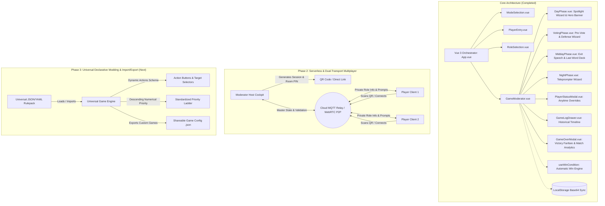

# Project Roadmap & Future Architecture

This document tracks completed milestones, current capabilities, and upcoming architectural evolutions for the **Mafia Party Game Assistant (MPGA)**.

---

## 🏛️ Architecture Evolution

---

## ✅ Completed Milestones

### 1. Anytime Moderator State Overrides & Player Management
* Added quick Kill/Revive actions on all seated players in the live dashboard.
* Added [`PlayerStatusModal.vue`](file:///Users/ali.heristchian/Documents/learning/mpga/src/components/PlayerStatusModal.vue) allowing the moderator to adjust living/dead state, issue warning cards, apply silence penalties, and log custom/preset reasons.

### 2. Centralized Game Action & Historical Event Logging
* Added persistent logging engine in [`gameStore.js`](file:///Users/ali.heristchian/Documents/learning/mpga/src/stores/gameStore.js) recording all speaker turns, challenges, pre-vote qualifications, final votes, tie-breaks, night targets, shields, blocks, saves, revives, and moderator overrides.
* Added sliding [`GameLogDrawer.vue`](file:///Users/ali.heristchian/Documents/learning/mpga/src/components/GameLogDrawer.vue) allowing the moderator to review past events filtered by Day, Phase, or player name.

### 3. Step-by-Step Guided Phase Wizards
* **Day Phase (`DayPhase.vue`):** Flow setup with direction shift $\rightarrow$ single-speaker spotlight countdown timer $\rightarrow$ challenge bonus time $\rightarrow$ wrap-up.
* **Voting Phase (`VotingPhase.vue`):** Interactive pre-vote tally with automatic threshold indicator ($\lceil \text{Alive}/2 \rceil$) $\rightarrow$ sequential defender countdown timers $\rightarrow$ closed-eye final vote $\rightarrow$ Destiny Spin tie-breaker.
* **Midday Phase (`MiddayPhase.vue`):** Exit speech countdown $\rightarrow$ animated Last Word Card draw roulette with deck retirement.
* **Night Phase (`NightPhase.vue`):** Sleep town call $\rightarrow$ step-by-step role wakeup teleprompter wizard with instant detective inquiry feedback $\rightarrow$ priority engine resolution $\rightarrow$ morning announcement script.

### 4. Atmospheric Visual Theming & Character Art System
* Implemented distinct color themes and ambient styling for Day (Solar Amber), Voting (Courtroom Crimson), Midday (Twilight Purple), and Night (Midnight Indigo).
* Created [`PhaseHeroBanner.vue`](file:///Users/ali.heristchian/Documents/learning/mpga/src/components/PhaseHeroBanner.vue) with vector SVG scenery for all sub-phases.
* Created [`roleIllustrations.js`](file:///Users/ali.heristchian/Documents/learning/mpga/src/data/roleIllustrations.js) with scalable SVG vector character artwork for all 9 game roles.
* Enhanced [`RoleAvatar.vue`](file:///Users/ali.heristchian/Documents/learning/mpga/src/components/RoleAvatar.vue) with scalable vector graphics, faction borders, and death state grayscale filters.

### 5. Automatic Win Condition Engine & Victory Celebration Modal
* Implemented pure evaluation service [`useWinCondition.js`](file:///Users/ali.heristchian/Documents/learning/mpga/src/services/useWinCondition.js) automatically checking Town victory (`livingMafia === 0`), Mafia parity victory (`livingMafia >= livingTown`), and Nostradamus co-victory.
* Created [`GameOverModal.vue`](file:///Users/ali.heristchian/Documents/learning/mpga/src/components/GameOverModal.vue) featuring victory fanfare, survivor roster with character art, match metrics summary tiles (Doctor saves, Detective inquiries, total eliminations, total match days), and decisive timeline highlights.
* Embedded non-destructive board inspection with top-bar victory badge in [`GameModerator.vue`](file:///Users/ali.heristchian/Documents/learning/mpga/src/components/GameModerator.vue).

### 6. Voting Limits & Rule Bounds Engine
* Created [`useVotingService.js`](file:///Users/ali.heristchian/Documents/learning/mpga/src/services/useVotingService.js) enforcing standard Mafia voting constraints (self-voting prohibition bounding votes per candidate to $\max(0, N_{\text{alive}} - 1)$).
* Enforced UI bounds and disabled state for pre-vote qualification and closed-eye final vote counters.
* Full test coverage with 7 dedicated unit tests in [`useVotingService.spec.js`](file:///Users/ali.heristchian/Documents/learning/mpga/src/services/useVotingService.spec.js).

### 7. Serverless P2P Multiplayer & Mobile Player Client
* Built using `PeerJS` over WebRTC direct data channels without backend servers.
* **Resilient Infrastructure:** Backed by Google STUN servers, OpenRelay TURN relays (`openrelay.metered.ca`), 20-second heartbeat keep-alives, and auto-reconnection handlers.
* **Host Pairing (`MultiplayerHostModal.vue`):** Generates 4-character Room ID, direct join URL, and sharp SVG QR code (`qrcode.vue`) with connected device indicators, host signaling status badge, and code regeneration.
* **Privacy-First Mobile Client (`PlayerClient.vue`):** Standalone mobile interface with visual roster seat claiming, tap-to-reveal secret role card, live speaker spotlight synchronization, night action console with real-time detective inquiry feedback, voting ballots, and timeout/retry recovery actions.
* **Strict Payload Sanitization:** `sanitizePlayerPayload` and `sanitizePublicGameState` ensure zero role leakage to foreign player clients.

### 8. Web Audio Procedural Sound Engine & Suno Custom Soundtrack Loader
* Synthesizes countdown warning ticks ($\le 10$s, $\le 3$s), resonant end-of-turn gongs, night fall & dawn rise chord progressions, roulette wheel mechanical ticks, and victory fanfares.
* Added phase-based custom soundtrack loader supporting Suno-generated AI music tracks with zero-bandwidth preservation controls.

### 9. Persian Localization, Language Switcher & Tournament Rule Polish
* **Pure Bilingual Architecture:** Added comprehensive Persian translation dictionary ([`src/locales/fa.json`](file:///Users/ali.heristchian/Documents/learning/mpga/src/locales/fa.json)) and cleaned English dictionary ([`src/locales/en.json`](file:///Users/ali.heristchian/Documents/learning/mpga/src/locales/en.json)), removing mixed parenthetical terms.
* **Dynamic Language Switcher (`LanguageSwitcher.vue`):** Instant EN / FA toggle with automatic document RTL/LTR layout switching and `localStorage` persistence.
* **Day Challenge Transfer System (`DayPhase.vue`):** Active speaker timer pause, spotlight handoff to challenger for borrowed time (`borrowedTimeToTalk`), single-challenge daily quota enforcement, and speaker resume.
* **Night 1 Mafia Introduction (`NightPhase.vue`):** Dedicated silent team familiarization step on Night 1 before individual role wake-ups.
* **Leon Guilt Penalty Resolution (`gameEngine.js`):** Leon shooting Town kills Leon at sunrise while sparing the Town target; Leon shooting Mafia eliminates the Mafia player.
* **Nostradamus 3-Player Inquiry (`NightPhase.vue`):** Multi-target selection with live Mafia count calculation and silent finger-signal cue.
* **Self-Targeting Guardrails:** Blocked self-targeting for Leon, Detective, Godfather, Matador, and Saul Goodman (Doctor self-target allowed).

### 10. Live Player Lobby, Room PIN Passcode & Automated Role Reveal
* **Live Room Lobby Setup (`PlayerEntry.vue`):** Host can generate a Room PIN passcode and display dynamic QR codes. Player phones join the lobby with their name and PIN, automatically populating the moderator roster in real time.
* **Drag-and-Drop Seating & Management:** Moderator can re-order players via HTML5 drag-and-drop to match the physical circle or remove disconnected peers.
* **Dedicated Mobile Lobby Screen (`PlayerClient.vue`):** Clean waiting room UI displaying room code, player's name, pulsing host-wait status, and a live roster of peers who joined the lobby.
* **Seamless Role Auto-Dispatch:** Once the moderator assigns roles and starts the game, connected player phones in the lobby instantly transition to their secret role reveal cards with privacy shielding.

### 11. Dual-Transport Multiplayer (Cloud MQTT Relay & Hardened WebRTC) + Proprietary License
* **Dual Transport Selector:** Moderator can choose between **☁️ Cloud Relay** (high-availability MQTT over Secure WebSockets via `broker.hivemq.com` with zero disconnects and live latency badge) and **⚡ WebRTC P2P** (direct browser-to-browser data channels with 3s keep-alive heartbeats and stable room codes).
* **Automatic Dynamic URL & QR Encoding:** Join links and QR codes automatically encode `&t=cloud` or `&t=webrtc`, allowing player phones to seamlessly pair on the host's selected engine.
* **Network Latency Monitor:** Added real-time 3.5s ping/pong latency measurement (`pingLatency` in ms) displayed in the client UI.
* **Proprietary Copyright & Legal License:** Added formal proprietary [`LICENSE`](file:///Users/ali.heristchian/Documents/learning/mpga/LICENSE) (Copyright (c) 2026 Ali Heristchian. All Rights Reserved) protecting all source code, algorithms, visual assets, and documentation.

---

## 🚀 Upcoming Milestones

### 1. 100% Declarative Config-Driven Game Engine & Universal Modding Architecture
**Goal:** Eliminate all hardcoded role `if` conditions (e.g. `if (role.id === 'godfather')` or `if (role.id === 'nostradamus')`) and replace them with a pure, declarative ability and scenario engine.
* **Declarative Character Schema:**
  - Every role definition in `roles.json` / `roles.js` will fully declare its:
    - `actions: []` (List of active abilities with execution priority, target filter, charge limits, and night teleprompter prompts).
    - `passives: []` (Shields, immunity, bulletproof counts, investigative immunity).
    - `inquiryResponse: 'town' | 'mafia' | 'custom'` (What the detective sees).
    - `winConditions: []` (Faction win condition definitions).
* **Universal Action Dispatcher (`executeAction(actionConfig, actor, targets)`):**
  - Pure execution engine that processes actions without knowing character names or specific hardcoded identities.
* **Game Pack Import & Export (Community Modding):**
  - Allow players and tournament hosts to export custom game modes, custom role configurations, and rule packs as `.json` or `.yaml` files.
  - One-click import button allowing players to load custom community scenarios without modifying the source code.

### 2. In-Game Interactive Role Chart, Hierarchy Tree & Game Guide (`GameGuideModal.vue`)
**Goal:** Provide an interactive in-game visual reference and flowchart explaining the current game mode, active roles, and their abilities.
* **Visual Role Hierarchy & Faction Tree:**
  - Interactive diagram categorizing all seated roles by faction (**Town 🟢**, **Mafia 🔴**, **Neutral/Third-Party 🟣**).
  - Clicking any role reveals its character art, story, alignment, and full breakdown of abilities ($a_1, a_2, \dots$):
    - Ability type (Kill, Save, Block, Inquire, Revive, Passive Shield).
    - Priority rank ($99 \rightarrow 10$).
    - Target constraints (Self-target permitted, living-only, charge limits).
    - Strategic advice and tournament ruling notes.
* **Night Resolution Flowchart:**
  - Visual timeline diagram showing the exact sequence of night wake-ups and ability resolutions for the current scenario.
* **Anytime In-Game Access:**
  - Accessible via top-bar `[❓ Guide]` icon on both moderator cockpit and mobile player screens (with secret role privacy shielding on player clients).

### 3. Dynamic Two-Step Action Selection UX (Action Button $\rightarrow$ Target Selection)
**Goal:** Replace single raw target dropdowns with explicit, labeled action buttons and dynamic candidate targeting.
* **Action Button Selector:**
  - When a character wakes up (e.g., Godfather, Silencer, Doctor), the UI displays clear, icon-labeled action buttons:
    - *Godfather:* `[🔫 Order Mafia Shot]` | `[🚫 Pass Shot]`
    - *Silencer:* `[🔇 Silence Player]` | `[🔫 Direct Shot]` | `[🚫 Pass]`
    - *Doctor:* `[💉 Treat Teammate]` | `[🛡️ Self-Heal (1 Charge)]`
* **Dynamic Target Filtering:**
  - Clicking an action button dynamically filters the target roster based on that specific action's rules (e.g. `allowSelf: false`, `onlyDead: true`, `maxTargets: 3`, `onlyUnshielded: true`).
  - Supports multi-target selection (e.g. Nostradamus 3-target inquiry) with validation before applying.

### 4. Standardized Descending Numerical Priority Engine
**Goal:** Unify the night resolution priority system into a standardized descending order (`99 > 90 > 50 > 10 > 1`) and align all role wake-ups with tournament standards.
* **Standard Priority Ladder:**
  1. **Priority 99 - Passive Shields & Immunity:** Godfather bulletproof, Nostradamus immunity.
  2. **Priority 90 - Role Blocking & Bribes:** Matador blocks, Saul Goodman bribes.
  3. **Priority 80 - Healing & Protection:** Doctor saves, Bodyguard guards.
  4. **Priority 70 - Lethal Shots:** Godfather shot, Vigilante (Leon) shot.
  5. **Priority 50 - Inquiries & Information:** Detective investigations, Nostradamus alignment reading.
  6. **Priority 10 - Post-Night Revivals & Dawn Announcements:** Constantine revive.
* **Unified Resolution Pipeline:**
  - `gameEngine.js` will sort actions strictly in descending numerical priority (`b.priority - a.priority`).

### 5. Multiplayer State Reactivity, Connected Player Roster Sync & Presence Healing
**Goal:** Ensure 100% reactive player connection lists, active device badges, and live seat assignments across both Cloud MQTT and WebRTC.
* **Live Connected Device Roster:**
  - Live player count badge in header and lobby automatically updates when players join, disconnect, or switch seats.
  - Active presence heartbeat prevents phantom disconnected sessions.
* **Multiplayer Cockpit Controls:**
  - Reactive action buttons in `MultiplayerHostModal` and `PlayerEntry` reflect real-time network states (`Connecting...`, `Connected (Cloud MQTT)`, `P2P Mesh Active`).

### 6. Headless Core State Machine (`@mpga/core`) & Time-Travel Event Sourcing
**Goal:** Decouple the game engine into a pure, headless state machine with deterministic event sourcing.
* **Pure Domain Engine:**
  - Zero dependencies on Vue, DOM, or browser APIs.
  - Enables mathematical balance simulations (simulating 10,000 matches in seconds).
* **Time-Travel Event Sourcing:**
  - Every game event is logged as an immutable delta.
  - Enables instant **1-step Undo / Moderator Misclick Rewind** and an interactive post-match **Time-Travel Match Replay Viewer**.

### 7. Stealth OLED Night Mode, Screen WakeLock & Tactile Haptic Feedback
**Goal:** Optimize physical party gameplay and eliminate inadvertent "screen glow" tells.
* **OLED Stealth Dark Mode:**
  - Deep pitch-black theme with ultra-low luminescence to prevent face illumination in dark rooms during the night phase.
* **Screen WakeLock API:**
  - Keeps moderator and player screens active during active speaking and defense timers without sleeping in pockets.
* **Tactile Haptic Vibrations (`navigator.vibrate`):**
  - Distinct vibration pulses for speaking turn start, 5-second defense warning, and elimination notices.

### 8. In-Browser Visual "Role Studio" & Scenario Builder
**Goal:** Allow users to build, test, and share custom characters and rulepacks in an intuitive visual studio.
* Drag-and-drop avatar, faction, abilities ($a_1, a_2$), priorities, and prompts.
* Instant generation of shareable QR codes and scenario pack links (`?pack=custom-scenario-id`).

### 9. Post-Match Infographics & Elo Tournament Leaderboards
**Goal:** Generate shareable visual recap story cards and track competitive rankings.
* **Dynamic Infographic Generator:** Canvas-rendered summary card for social sharing (Instagram / WhatsApp) highlighting MVPs, key saves, and match timeline.
* **Tournament Elo & Leaderboards:** Aggregate win rates and performance ratings across tournament rounds.

### 10. Automated Multi-Device E2E Simulation (Playwright)
**Goal:** Continuous quality verification with automated multi-client simulations.
* Playwright test suite spinning up 1 Host + 10 virtual Player mobile browsers executing full match lifecycles automatically on CI.

### 11. Offline PWA (Progressive Web App) & Service Worker Support
**Goal:** Enable complete offline playability and home screen installability on mobile devices and tablets during tournaments with intermittent connectivity.
* Add web app manifest, custom icons, and Workbox caching for all application assets and audio files.

### 12. Spectator Mode & Public Display View
**Goal:** Provide a dedicated projector / spectator display URL (`/?view=spectator` or `/?view=projector`) showing live speaker spotlights, vote tallies, and phase art without revealing secret roles.

### 13. Audio DJ Console, Custom Soundtracks & TTS Moderator Prompts
**Goal:** Allow hosts to select alternative sound packs or enable Web Speech synthesis for automated night teleprompter announcements.

### 14. Tournament Bracket & Multi-Table League Management
**Goal:** Support tournament organizers managing multi-table events with master standings, player ranking points, and aggregated tournament statistics.

### 15. TypeScript 5 Strict Schema Migration
* Migrate from Vanilla JS to **TypeScript** (`<script setup lang="ts">`).
* Define strict TypeScript interfaces (`Player`, `Role`, `Ability`, `GameMode`, `NightAction`, `GameEventLog`, `LastWordCard`, `GameStatusResult`).

