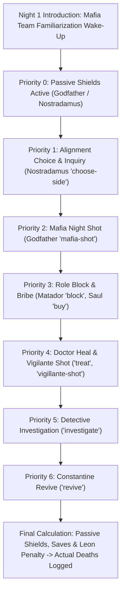

# Mafia Rules & Mechanics

This document provides a comprehensive reference for game mechanics, faction rules, role abilities, Last Word Cards, night resolution priority, and victory conditions in the Mafia Party Game Assistant (MPGA).

---

## 1. Game Factions & Win Conditions

| Faction | Objective | Win Condition | Color Theme |
| :--- | :--- | :--- | :--- |
| **Town (Citizens)** | Identify and eliminate all Mafia members. | All living Mafia players are eliminated (`livingMafia === 0`). | `text-town` (Blue / `#3B82F6`) |
| **Mafia** | Eliminate Town members and take control of the town. | The number of living Mafia players equals or exceeds the number of living Town players (`livingMafia >= livingTown`). | `text-mafia` (Red / `#EF4444`) |
| **Third Party (Nostradamus)** | Align with a chosen faction on Night 1 and survive/assist them. | Wins alongside whichever team (`town` or `mafia`) they pledged allegiance to on Night 1. | `text-thirdParty` (Purple / `#A855F7`) |

### Automatic Win Calculation Logic
The calculation engine in [`src/services/useWinCondition.js`](file:///Users/ali.heristchian/Documents/learning/mpga/src/services/useWinCondition.js) evaluates live player states on every status change:
1. **Town Victory (`winner: 'town'`):** Triggered when `livingMafiaCount === 0 && livingTownCount > 0`.
2. **Mafia Victory (`winner: 'mafia'`):** Triggered when `livingMafiaCount >= livingTownCount && livingMafiaCount > 0`.
3. **Draw / Stalemate (`winner: 'draw'`):** Triggered if both living counts reach `0`.
4. **Nostradamus Co-Victory (`nostradamusWon: true`):** If a Nostradamus is in play and their recorded Night 1 choice matches the calculated `winner`, Nostradamus is credited with a co-victory.
5. **Match Statistics Aggregation:** When game over occurs, the engine automatically collates metrics from `gameLogs` (total Doctor saves, Detective positive hits, total eliminations, total match days, and surviving player list).

---

## 2. Roles Reference

### Town Faction (`sideId: 'town'`)

* **Citizen (`citizen`)**
  * *Description:* Standard town resident with no active night abilities.
  * *Role in Game:* Relies on daytime debate, intuition, voting patterns, and behavior analysis to eliminate Mafia during the Day and Voting phases.
* **Doctor (`doctor`)**
  * *Active Ability (`treat`):* Chooses one player each night to protect from elimination.
  * *Rules:* If the protected target is attacked by Mafia or Vigilante, the target survives.
* **Detective (`detective`)**
  * *Active Ability (`investigate`):* Investigates one player per night to learn if they are Mafia.
  * *Moderator Signal & Gesture Protocol:*
    * The fundamental inquiry question is: **"Is this player a Mafia?"** (*آیا این بازیکن مافیا است؟*)
    * **Thumbs Up (👍):** **YES / Positive Inquiry (`استعلام مثبت`)** $\to$ The target IS a Mafia member.
    * **Thumbs Down (👎):** **NO / Negative Inquiry (`استعلام منفی`)** $\to$ The target is NOT Mafia (Citizen / Town member).
  * *Godfather Exception:* In standard Godfather tournament rules, the Godfather has a clean inquiry (*استعلام منفی*) and appears innocent (Thumbs Down 👎) unless stated otherwise.
* **Constantine (`constantine`)**
  * *Active Ability (`revive`):* Can revive one eliminated player back into the game (typically once per game).
  * *Rules:* Target must be currently dead. The revived player re-enters as an active living player.
* **Leon / Vigilante (`leon`)**
  * *Active Ability (`vigillante-shot`):* Can take a night shot to eliminate a suspected Mafia player.
  * *Rules & Penalty:* High risk. If Leon targets an innocent Town citizen, Leon dies from guilt at sunrise while the innocent citizen survives unharmed. If Leon targets a Mafia player, the Mafia member is eliminated. Leon cannot target themselves.

### Mafia Faction (`sideId: 'mafia'`)

* **Godfather (`godfather`)**
  * *Active Ability (`mafia-shot`):* Directs the Mafia's deadly night shot. Cannot target themselves.
  * *Passive Ability (`shield`):* Possesses a bulletproof shield that absorbs one night shot before breaking.
* **Matador (`matador`)**
  * *Active Ability (`block`):* Blocks one player per night, preventing them from using their active night ability. Cannot target themselves.
  * *Rules:* If the Matador blocks a Doctor, Detective, or Vigilante, their action for that night fails.
* **Saul Goodman (`saul-goodman`)**
  * *Active Ability (`buy`):* Can bribe or influence players, creating strategic advantages for the Mafia. Cannot target themselves.
* **Mafia Grunt (`mafia`)**
  * *Description:* Regular Mafia member who participates in team deliberations and voting during the day.
  * *Night 1 Familiarization:* On Night 1, all Mafia members wake up together silently to recognize their teammates.

### Third Party (`sideId: 'third-party'`)

* **Nostradamus (`nostradamus`)**
  * *Night 1 3-Player Inquiry:* On Night 1, Nostradamus selects 3 living players. The moderator counts how many of those 3 are Mafia members and silently shows the count using fingers (e.g., 2 fingers = 2 Mafias). The identities of *which* players are Mafia remain hidden.
  * *Majority Threshold & Tactical Rule:* If the count of Mafia members among the 3 choices exceeds half of the total living Mafias in the game ($> N_{\text{mafia}}/2$, e.g., $\ge 2$ Mafias in a 3-Mafia game), Nostradamus is strategically recommended to side with the **Mafia**.
  * *Third-Party Agency:* Nostradamus is an independent 3rd-party role and retains full strategic freedom to choose whichever side (`town` or `mafia`) they wish, and can decide how to play throughout the game.
  * *Passive Ability (`unlimited-shield`):* Permanent night-shot immunity to ensure third-party balance.

---

## 3. Last Word Cards (*کارت حرکت آخر*)

When a player is eliminated during the daytime Voting phase, they enter the **Midday (*Nim-Rouz*) Phase** where they give an exit speech and draw one random card from the remaining deck. Drawn cards are permanently retired.

| Card Name | Identifier | Effect & Peripheral Rules |
| :--- | :--- | :--- |
| **Mind Inquiry (ذهن‌زیبا)** | `mind-inquiry` | The eliminated player can guess the exact roles of up to 2 living players. If correct, special tournament points/rewards apply. |
| **Silence of the Lambs (سکوت بره)** | `silence` | The eliminated player selects one living player who cannot speak during the next Day phase. |
| **Redemption (فرش قرمز)** | `redemption` | The eliminated player designates a candidate who will be automatically brought to the defense stage on the next day's voting. |
| **Final Shot / Double Vote (شلیک نهایی)** | `double-vote` | Grants the player's faction or chosen ally an extra voting point in the next voting phase. |
| **Identity Reveal (افشای هویت)** | `revealed-alignment` | The moderator publicly announces the exact role and alignment of the eliminated player to the town. |
| **Golden Inquiry (ذهن طلایی)** | `beautiful-mind` | The eliminated player asks the moderator whether a specific faction holds a majority in a chosen section of the table. |

---

## 4. Night Action Resolution & Priority Engine

Night actions cannot be resolved simultaneously because dependencies exist (e.g., a **Block** must occur before a **Heal** or **Shot**, and **Heals** prevent **Deaths**).

### Resolution Order Table

| Priority | Action / Ability | Actor | Target Restrictions | Effect / Logic |
| :---: | :--- | :--- | :--- | :--- |
| **N/A** | *Mafia Introduction* | All Living Mafia | Self Team (Night 1 only) | Familiarization wake-up (no shot/kill). |
| **0** | `shield` / `unlimited-shield` | Godfather, Nostradamus | Self (Passive) | Protects bearer against deadly shots. |
| **1** | `choose-side` | Nostradamus | Up to 3 players + Town/Mafia choice | Moderator signals Mafia count; records chosen win condition. |
| **2** | `mafia-shot` | Godfather | Other living players | Marks target for elimination unless protected or shielded. |
| **3** | `block` | Matador | Other living players | Cancels the target's ability if priority > 3. |
| **3** | `buy` | Saul Goodman | Other living players | Applies bribe effect for the night/day. |
| **4** | `treat` | Doctor | Any living player (self-target allowed) | Saves target from elimination if shot on the same night. |
| **4** | `vigillante-shot` | Leon (Vigilante) | Other living players | If target is Town: Leon dies, target safe. If target is Mafia: Mafia dies. |
| **5** | `investigate` | Detective | Other living players | Reveals target's faction (`town` vs. `mafia`) in moderator log. |
| **6** | `revive` | Constantine | Dead players only | Restores a dead player back to life (`isDead: false`). |

---

## 5. Game Modes & Balance Rules

Modes are configured in [`src/data/modes.js`](file:///Users/ali.heristchian/Documents/learning/mpga/src/data/modes.js):

* **Godfather Mode:**
  * Minimum Players: 4 (recommended: 8–12)
  * Speaking Time: 40 seconds
  * Borrowed / Challenge Time: 25 seconds
  * Defense Speech Time: 60 seconds
  * Daily Turn Shift: 2 seats
  * Voting Rounding: `ceil` (half of alive players rounded up)
  * Balance Constraint: Maximum Mafia ratio is 34% of total player count.
* **Classic Mafia Mode:**
  * **Allowed Roles:** Pure 4-role classic setup: **Mafia (`mafia`)**, **Citizen (`citizen`)**, **Detective / Cop (`detective`)**, and **Doctor (`doctor`)**. Advanced roles (Godfather, Matador, Saul Goodman, Nostradamus, Constantine, Leon) are excluded.
  * Minimum Players: 4 (recommended: 6–10)
  * Speaking Time: 60 seconds
  * Borrowed / Challenge Time: 30 seconds
  * Defense Speech Time: 60 seconds
  * Daily Turn Shift: 1 seat
  * Voting Rounding: `half` (standard `Math.round`)
  * Balance Constraint: Maximum Mafia ratio is 33% of total player count.

* **Godfather Scenario Mode (Iranian Mafia Tournament):**
  * **Allowed Roles:** Full 10-role tournament roster: Godfather, Matador, Saul Goodman, Mafia, Doctor, Detective, Citizen, Nostradamus, Constantine, Leon.
  * Minimum Players: 4 (standard: 10 players)
  * Speaking Time: 40 seconds
  * Borrowed / Challenge Time: 25 seconds
  * Defense Speech Time: 60 seconds
  * Daily Turn Shift: 2 seats
  * Voting Rounding: `ceil`
  * Balance Constraint: Maximum Mafia ratio is 34% of total player count.

---

## 6. Voting Mechanics & Candidate Caps

Voting calculations and constraints are handled by [`src/services/useVotingService.js`](file:///Users/ali.heristchian/Documents/learning/mpga/src/services/useVotingService.js):

1. **Self-Voting Prohibition & Maximum Vote Cap:**
   * In standard Mafia rules, a player under accusation/vote cannot vote to eliminate or qualify themselves.
   * Consequently, the maximum number of votes any single candidate can receive in either Pre-Vote or Final Vote stages is strictly bounded by:
     $$\text{Max Votes} = \max(0, N_{\text{alive}} - 1)$$
   * UI increment controls automatically disable when this ceiling is reached, and vote inputs are clamped within $[0, \text{Max Votes}]$.
2. **Pre-Vote Qualification Threshold:**
   * A player qualifies for the defense stage if their pre-vote tally reaches the mode-defined threshold:
     $$\text{Threshold}_{\text{ceil}} = \lceil N_{\text{alive}} / 2 \rceil \quad \text{or} \quad \text{Threshold}_{\text{round}} = \text{round}(N_{\text{alive}} / 2)$$
3. **Closed-Eye Final Vote:**
   * Defenders who reach the threshold enter defense speeches followed by closed-eye town voting.
   * The defender receiving the highest final vote count is eliminated. Ties trigger the Destiny Spin tie-breaker roulette.

---

## 7. Day Phase Speaking & Challenge Time Protocol

1. **Spotlight Speaking Turns:**
   * Each living player receives an uninterrupted timed speaking turn (e.g., 40s in Godfather mode, 60s in Classic mode).
2. **Challenge Time Request & Transfer:**
   * While a player is speaking, another living player can request "Challenge Time" (وقت چالش) from the active speaker.
   * If granted, the speaker's main countdown timer is paused, and the challenger is placed in the spotlight for a shorter speech duration (`borrowedTimeToTalk`, e.g., 25s).
3. **Single-Use Daily Constraint:**
   * **One Challenge Per Speaker:** At most one challenge can be granted per speaker turn.
   * **One Challenge Per Player Per Day:** Once a player takes challenge time, they are marked as having used their challenge quota for that Day phase and cannot request or take challenge time again until the next day.
4. **Speaker Resume:**
   * When the challenger's time expires or the moderator ends the challenge early, the spotlight returns to the original speaker who finishes their exact remaining paused seconds.
