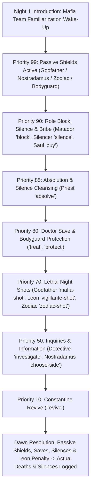

# Mafia Rules & Mechanics

This document provides a comprehensive reference for game mechanics, faction rules, role abilities, Last Word Cards, night resolution priority, and victory conditions in the Mafia Party Game Assistant (MPGA).

---

## 1. Game Factions & Win Conditions

| Faction | Objective | Win Condition | Color Theme |
| :--- | :--- | :--- | :--- |
| **Town (Citizens / Blue Team)** | Identify and eliminate all Mafia / Syndicate members and hostile threats. | All living Mafia and hostile Third-Party (Zodiac / Rogue AI) players are eliminated (`livingMafia === 0 && livingHostileThirdParty === 0`). | `text-town` (Blue / `#3B82F6` / Emerald `#10B981`) |
| **Mafia (Syndicate / Red Team)** | Eliminate Town / Blue Team members and control the network. | The number of living Mafia players equals or exceeds the number of living Town players (`livingMafia >= livingTown`), and no hostile third party remains. | `text-mafia` (Red / `#EF4444` / Rose `#F43F5E`) |
| **Third Party (Nostradamus)** | Align with a chosen faction on Night 1 and survive/assist them. | Wins alongside whichever team (`town` or `mafia`) they pledged allegiance to on Night 1. | `text-thirdParty` (Purple / `#A855F7`) |
| **Third Party (Zodiac / Rogue AI)** | Solo elimination of all other factions. | Outlasts both Town and Mafia (`livingMafia === 0 && livingTown === 0 && livingHostileThirdParty > 0`). | `text-amber-400` (Amber / `#F59E0B` / Violet `#8B5CF6`) |

### Declarative Universal Faction Engine (v2.1.0)
MPGA is completely domain-agnostic. In addition to legacy Town/Mafia rules, the game engine supports arbitrary $N$-faction rulepacks with declarative win conditions:
1. **Elimination Win Condition (`type: 'elimination'`):** Wins when all target factions in `targetFactionIds` have zero living members (e.g. Blue Team eliminating Red Team and Rogue AI).
2. **Parity Win Condition (`type: 'parity'`):** Wins when living members of this faction meet or exceed the sum of living members in `parityAgainstFactionIds` according to the configured `parityRatio` (default $0.5$).
3. **Last Standing Win Condition (`type: 'last_standing'`):** Wins when all players of other factions are eliminated and only this faction's members remain alive.

### Automatic Win Calculation Logic
The calculation engine in [`src/services/useWinCondition.ts`](file:///Users/ali.heristchian/Documents/learning/mpga/src/services/useWinCondition.ts) evaluates live player states on every status change:
1. **Declarative Faction Evaluation:** When `activeUniversalPack.factions` or `customFactions` are present, evaluates declarative rules sequentially.
2. **Town Victory (`winner: 'town'`):** Fallback when `livingMafiaCount === 0 && livingTownCount > 0 && livingHostileThirdPartyCount === 0`.
3. **Mafia Victory (`winner: 'mafia'`):** Fallback when `livingMafiaCount >= livingNonMafiaCount && livingMafiaCount > 0 && livingHostileThirdPartyCount === 0`.
4. **Third-Party Solo Victory (`winner: 'third-party'`):** Fallback when Town and Mafia have both been eliminated while a hostile third-party (Zodiac or Rogue AI) survives.
5. **Draw / Stalemate (`winner: 'draw'`):** Triggered if both living counts reach `0`.
6. **Nostradamus Co-Victory (`nostradamusWon: true`):** If a Nostradamus is in play and their recorded Night 1 choice matches the calculated `winner`, Nostradamus is credited with a co-victory.
7. **Match Statistics Aggregation:** When game over occurs, the engine automatically collates metrics from `gameLogs` (total Doctor saves, Detective positive hits, total eliminations, total match days, and surviving player list).

---

## 2. Roles Reference

### Town Faction (`sideId: 'town'`)

* **Citizen (`citizen`)**
  * *Description:* Standard town resident with no active night abilities.
  * *Role in Game:* Relies on daytime debate, intuition, voting patterns, and behavior analysis to eliminate Mafia during the Day and Voting phases.
* **Doctor (`doctor`)**
  * *Active Ability (`treat`):* Chooses one player each night to protect from elimination.
  * *Rules:* If the protected target is attacked by Mafia or Vigilante, the target survives.
* **Detective (`detective`)**
  * *Active Ability (`investigate`):* Investigates one player per night to learn if they are Mafia.
  * *Moderator Signal & Gesture Protocol:*
    * The fundamental inquiry question is: **"Is this player a Mafia?"** (*آیا این بازیکن مافیا است؟*)
    * **Thumbs Up (👍):** **YES / Positive Inquiry (`استعلام مثبت`)** $\to$ The target IS a Mafia member.
    * **Thumbs Down (👎):** **NO / Negative Inquiry (`استعلام منفی`)** $\to$ The target is NOT Mafia (Citizen / Town member).
  * *Godfather Exception:* In standard Godfather tournament rules, the Godfather has a clean inquiry (*استعلام منفی*) and appears innocent (Thumbs Down 👎) unless stated otherwise.
* **Constantine (`constantine`)**
  * *Active Ability (`revive`):* Can revive one eliminated player back into the game (typically once per game).
  * *Rules:* Target must be currently dead. The revived player re-enters as an active living player.
* **Leon / Vigilante (`leon`)**
  * *Active Ability (`vigillante-shot`):* Can take a night shot to eliminate a suspected Mafia player.
  * *Rules & Penalty:* High risk. If Leon targets an innocent Town citizen, Leon dies from guilt at sunrise while the innocent citizen survives unharmed. Under Iranian Mafia tournament rules, **Leon's guilt penalty is absolute and unpreventable** — a Doctor cannot save Leon from guilt death. If Leon targets a Mafia player, the Mafia member is eliminated. Leon cannot target themselves.
* **Bodyguard (`bodyguard`)**
  * *Active Ability (`protect`):* Chooses one player each night to protect from lethal attacks.
  * *Passive Ability (`shield`):* Possesses a single-use bulletproof shield that absorbs one deadly shot.
* **Priest (`priest`)**
  * *Active Ability (`absolve`):* Chooses one player each night to cleanse from silence, canceling the Silencer's gag before sunrise.
* **Firewall Server (`firewall-server`)**
  * *Active Ability (`patch-sandbox`):* Quarantines and patches one node each night, shielding them from fatal zero-day exploits or malware purges.
  * *Passive Ability (`shield`):* Equipped with a hardware fallback shield protecting against one attack.
* **Security Analyst (`sec-analyst`)**
  * *Active Ability (`port-scan`):* Deep packet inspection of a target node. Detects Black-Hat Syndicate members (Zero-Day and Rogue AI appear clean).
* **White-Hat Hacker (`white-hat`)**
  * *Active Ability (`counter-hack`):* Launches a surgical counter-strike against a suspected intruder. Eliminates Black-Hat operatives; if an innocent Town user is hit, the White-Hat is eliminated by the guilt authorization penalty!
* **DevOps Admin (`devops-admin`)**
  * *Active Ability (`auth-restore`):* Reissues revoked credentials and restores voice access to silenced nodes.
* **System User (`sys-user`)**
  * *Passive (`deduction`):* Standard verified user with no active night tools; relies on daytime log telemetry, discussion, and consensus votes.

### Mafia & Black-Hat Factions (`sideId: 'mafia'`)

* **Godfather (`godfather`)**
  * *Active Ability (`mafia-shot`):* Directs the Mafia's deadly night shot. Cannot target themselves.
  * *Passive Ability (`shield`):* Possesses a strict single-use bulletproof shield (starts with 1 charge). Upon taking a deadly night shot, the shield absorbs the attack, logs a save, and shatters (`isShieldBroken = true`, charges drop to 0). If the Godfather takes multiple lethal shots in the same night (e.g., from Leon and Zodiac), the first hit shatters the shield and the second hit eliminates them. On all subsequent nights after shattering, the shield offers zero protection.
* **Matador (`matador`)**
  * *Active Ability (`block`):* Blocks one player per night, preventing them from using their active night ability. Cannot target themselves.
  * *Rules:* If the Matador blocks a Doctor, Detective, or Vigilante, their action for that night fails.
* **Silencer (`silencer`)**
  * *Active Ability (`silence`):* Gags one player each night, forbidding them from speaking, participating in discussions, or requesting challenge time during the entire upcoming Day phase.
* **Saul Goodman (`saul-goodman`)**
  * *Active Ability (`buy`):* Can bribe or recruit players. In Iranian Mafia tournament rules, if Saul Goodman buys a simple **Citizen (`citizen`)**, that citizen is corrupted and permanently converts to the Mafia team (`sideId: 'mafia'`). If used on roles other than simple Citizen, the bribe fails to recruit. Cannot target themselves.
* **Mafia Grunt (`mafia`)**
  * *Description:* Regular Mafia member who participates in team deliberations and voting during the day.
  * *Night 1 Familiarization:* On Night 1, all Mafia members wake up together silently to recognize their teammates.

#### Mafia Night Kill Succession & Delegation (Godfather Scenario)
In Iranian Mafia tournament rules (Godfather scenario), the living Mafia team holds **one collective lethal shot per night (`mafia-shot`)**:
* **Godfather Alive:** The Godfather holds the weapon and selects the Mafia team's target.
* **Godfather Eliminated (Succession Order):** When the Godfather is killed or exiled, leadership of the night kill passes down the hierarchy to the next surviving Mafia member:
  1. **Matador (`matador`)** (1st successor)
  2. **Saul Goodman (`saul-goodman`)** (2nd successor)
  3. **Simple Mafia Grunt (`mafia`)** (3rd successor)
  4. **Fallback:** Any surviving living Mafia member.
* **Dual Action Execution:** The designated successor executes **both** their personal active role ability (e.g., Matador blocks an opponent, Saul Goodman recruits/bribes) **and** the Mafia team kill (`mafia-shot`). The teleprompter wizard prompts the moderator with a dedicated step, and mobile clients expose the `mafia-shot` action.
* **Blocking Rule:** If the successor shooter is blocked by an opposing blocker (e.g., Guard or Botnet Op), **both** their personal ability and the Mafia team shot are nullified for that night.

* **Zero-Day (`zero-day`)**
  * *Active Ability (`zero-day-exploit`):* Syndicate mastermind directing fatal remote code execution payloads.
  * *Passive Abilities:* Single-use cryptographic shield (`shield`) and clean telemetry inquiry (`clean-inquiry`).
* **Botnet Operator (`botnet-op`)**
  * *Active Ability (`ddos-flood`):* Floods a target node with high-volume DDoS traffic, disabling their active night ability for that night.
* **Phisher (`phisher`)**
  * *Active Ability (`credential-lock`):* Deploys spear-phishing lures to lock down target credentials, muting their daytime speech.
* **Black-Hat Operative (`black-hat`)**
  * *Active Ability (`zero-day-exploit`):* Tactical operative executing coordinated exploits and night eliminations with the syndicate.

### Third Party & Autonomous Entities (`sideId: 'third-party'`)

* **Zodiac (`zodiac`)**
  * *Active Ability (`zodiac-shot`):* Delivers a lethal night shot to eliminate any targeted player.
  * *Passive Abilities:*
    * *Bulletproof Shield (`shield`):* Single-use armor absorbing one deadly attack.
    * *Clean Inquiry (`clean-inquiry`):* Registers as Innocent / Negative inquiry (Thumbs Down 👎) to the Detective.
  * *Win Condition:* Outlasts both Town and Mafia factions. Town cannot claim victory while Zodiac is alive.
* **Rogue AI (`rogue-ai`)**
  * *Active Ability (`malware-purge`):* Executes autonomous polymorphic malware purges against any target player.
  * *Passive Abilities:*
    * *Neural Shield (`shield`):* Single-use defense absorbing one fatal attack.
    * *Clean Telemetry (`clean-inquiry`):* Registers as Innocent / Clean during Security Analyst port scans and Detective inquiries.
  * *Win Condition:* Independent malicious system. Wins alone when all Town and Syndicate nodes have been purged.
* **Nostradamus (`nostradamus`)**
  * *Night 1 3-Player Inquiry:* On Night 1, Nostradamus selects 3 living players. The moderator counts how many of those 3 are Mafia members and silently shows the count using fingers (e.g., 2 fingers = 2 Mafias). The identities of *which* players are Mafia remain hidden.
  * *Majority Threshold & Tactical Rule:* If the count of Mafia members among the 3 choices exceeds half of the total living Mafias in the game ($> N_{\text{mafia}}/2$, e.g., $\ge 2$ Mafias in a 3-Mafia game), Nostradamus is strategically recommended to side with the **Mafia**.
  * *Third-Party Agency:* Nostradamus is an independent 3rd-party role and retains full strategic freedom to choose whichever side (`town` or `mafia`) they wish, and can decide how to play throughout the game.
  * *Passive Ability (`unlimited-shield`):* Permanent night-shot immunity to ensure third-party balance.

---

## 3. Last Word Cards (*کارت حرکت آخر*)

When a player is eliminated during the daytime Voting phase, they enter the **Midday (*Nim-Rouz*) Phase** where they give an exit speech and draw one random card from the remaining deck. Drawn cards are permanently retired.

| Card Name | Identifier | Effect & Peripheral Rules |
| :--- | :--- | :--- |
| **Mind Inquiry (ذهن‌زیبا)** | `mind-inquiry` | The eliminated player can guess the exact roles of up to 2 living players. If correct, special tournament points/rewards apply. |
| **Silence of the Lambs (سکوت بره)** | `silence` | The eliminated player selects one living player who cannot speak during the next Day phase. |
| **Redemption (فرش قرمز)** | `redemption` | The eliminated player designates a candidate who will be automatically brought to the defense stage on the next day's voting. |
| **Final Shot / Double Vote (شلیک نهایی)** | `double-vote` | Grants the player's faction or chosen ally an extra voting point in the next voting phase. |
| **Identity Reveal (افشای هویت)** | `revealed-alignment` | The moderator publicly announces the exact role and alignment of the eliminated player to the town. |
| **Golden Inquiry (ذهن طلایی)** | `beautiful-mind` | The eliminated player asks the moderator whether a specific faction holds a majority in a chosen section of the table. |

---

## 4. Night Action Resolution & Priority Engine

Night actions cannot be resolved simultaneously because dependencies exist (e.g., a **Block** must occur before a **Heal** or **Shot**, and **Heals** prevent **Deaths**).

### Standardized Descending Priority Ladder (Higher Number = Executes First)

| Priority | Action / Ability | Actor | Target Restrictions | Effect / Logic |
| :---: | :--- | :--- | :--- | :--- |
| **N/A** | *Mafia / Syndicate Intro* | All Living Mafia | Self Team (Night 1 only) | Familiarization wake-up (no shot/kill). |
| **99** | `shield` / `unlimited-shield` | Godfather, Nostradamus, Zodiac, Bodyguard, Zero-Day, Firewall Server, Rogue AI | Self (Passive) | Protects bearer against deadly attacks. |
| **90** | `block` / `ddos-flood` | Matador, Botnet Operator | Other living players | Cancels the target's ability execution for the night. |
| **90** | `silence` / `credential-lock` | Silencer, Phisher | Other living players | Gags target; removes speech and challenge rights for the next Day phase. |
| **90** | `buy` | Saul Goodman | Other living players | Applies bribe effect for the night/day. |
| **85** | `absolve` / `auth-restore` | Priest, DevOps Admin | Any living player | Cleanses target from silence, lifting the gag/lockout. |
| **80** | `treat` / `protect` / `patch-sandbox` | Doctor, Bodyguard, Firewall Server | Any living player | Saves/shields target from elimination if attacked on the same night. |
| **70** | `mafia-shot` / `zero-day-exploit` | Godfather, Zero-Day, Black-Hat | Other living players | Marks target for elimination unless saved or shielded. |
| **70** | `zodiac-shot` / `malware-purge` | Zodiac, Rogue AI | Any other living player | Marks target for elimination unless saved or shielded. |
| **70** | `vigillante-shot` / `counter-hack` | Leon (Vigilante), White-Hat | Other living players | If target is Town: Shooter dies from guilt penalty, target safe. If target is Mafia: Mafia dies. |
| **50** | `investigate` / `port-scan` | Detective, Security Analyst | Other living players | Reveals target's faction (`town` vs. `mafia`). Clean inquiry passives appear clean. |
| **50** | `choose-side` | Nostradamus | Up to 3 players + Town/Mafia choice | Moderator signals Mafia count; records chosen win condition. |
| **10** | `revive` | Constantine | Dead players only | Restores a dead player back to life (`isDead: false`). |

---

## 5. Game Modes & Balance Rules

Modes are configured in [`src/data/modes.ts`](file:///Users/ali.heristchian/Documents/learning/mpga/src/data/modes.ts):

* **Godfather Mode:**
  * Minimum Players: 4 (recommended: 8–12)
  * Speaking Time: 40 seconds
  * Borrowed / Challenge Time: 25 seconds
  * Defense Speech Time: 60 seconds
  * Daily Turn Shift: 2 seats
  * Voting Rounding: `ceil` (half of alive players rounded up)
  * Balance Constraint: Maximum Mafia ratio is 34% of total player count.
* **Classic Mafia Mode:**
  * **Allowed Roles:** Pure 4-role classic setup: **Mafia (`mafia`)**, **Citizen (`citizen`)**, **Detective / Cop (`detective`)**, and **Doctor (`doctor`)**. Advanced roles are excluded.
  * Minimum Players: 4 (recommended: 6–10)
  * Speaking Time: 60 seconds
  * Borrowed / Challenge Time: 30 seconds
  * Defense Speech Time: 60 seconds
  * Daily Turn Shift: 1 seat
  * Voting Rounding: `half` (standard `Math.round`)
  * Balance Constraint: Maximum Mafia ratio is 33% of total player count.
* **Zodiac Scenario Mode:**
  * **Allowed Roles:** Zodiac, Bodyguard, Godfather, Doctor, Detective, Mafia, Citizen.
  * Minimum Players: 5 (standard: 8–12 players)
  * Speaking Time: 45 seconds
  * Borrowed / Challenge Time: 25 seconds
  * Daily Max Challenges: 2 challenges per day
  * Daily Turn Shift: 2 seats
  * Voting Rounding: `ceil`
  * Balance Constraint: Solo third-party assassin mechanic.
* **Noir Vendetta Mode:**
  * **Allowed Roles:** Silencer, Priest, Godfather, Doctor, Detective, Mafia, Citizen.
  * Minimum Players: 5 (standard: 8–12 players)
  * Speaking Time: 50 seconds
  * Borrowed / Challenge Time: 25 seconds
  * Defense Speech Time: 60 seconds
  * Daily Turn Shift: 1 seat
  * Voting Rounding: `ceil`
  * Balance Constraint: Silencer and Priest tactical counter-play.
* **Cyber Breach Mode (`cyber-breach`):**
  * **Allowed Roles:** Zero-Day, Botnet Operator, Phisher, Black-Hat, Firewall Server, Security Analyst, White-Hat, DevOps Admin, System User, Rogue AI.
  * Minimum Players: 6 (standard: 8–12 players)
  * Speaking Time: 45 seconds
  * Borrowed / Challenge Time: 25 seconds
  * Defense Speech Time: 60 seconds
  * Daily Max Challenges: 2 challenges per day
  * Daily Turn Shift: 2 seats
  * Voting Rounding: `ceil`
  * Balance Constraint: Information warfare between Blue Team defenders, Black-Hat syndicate, and an autonomous Rogue AI threat. Maximum Mafia ratio is 34%.

---

## 6. Voting Mechanics & Candidate Caps

Voting calculations and constraints are handled by [`src/services/useVotingService.js`](file:///Users/ali.heristchian/Documents/learning/mpga/src/services/useVotingService.js):

1. **Self-Voting Prohibition & Maximum Vote Cap:**
   * In standard Mafia rules, a player under accusation/vote cannot vote to eliminate or qualify themselves.
   * Consequently, the maximum number of votes any single candidate can receive in either Pre-Vote or Final Vote stages is strictly bounded by:
     $$\text{Max Votes} = \max(0, N_{\text{alive}} - 1)$$
   * UI increment controls automatically disable when this ceiling is reached, and vote inputs are clamped within $[0, \text{Max Votes}]$.
2. **Pre-Vote Qualification Threshold:**
   * A player qualifies for the defense stage if their pre-vote tally reaches the mode-defined threshold:
     $$\text{Threshold}_{\text{ceil}} = \lceil N_{\text{alive}} / 2 \rceil \quad \text{or} \quad \text{Threshold}_{\text{round}} = \text{round}(N_{\text{alive}} / 2)$$
3. **Closed-Eye Final Vote:**
   * Defenders who reach the threshold enter defense speeches followed by closed-eye town voting.
   * The defender receiving the highest final vote count is eliminated. Ties trigger the Destiny Spin tie-breaker roulette.

---

## 7. Day Phase Speaking & Challenge Time Protocol

1. **Spotlight Speaking Turns:**
   * Each living player receives an uninterrupted timed speaking turn (e.g., 40s in Godfather mode, 60s in Classic mode).
2. **Challenge Time Request & Transfer:**
   * While a player is speaking, another living player can request "Challenge Time" (وقت چالش) from the active speaker.
   * If granted, the speaker's main countdown timer is paused, and the challenger is placed in the spotlight for a shorter speech duration (`borrowedTimeToTalk`, e.g., 25s).
3. **Single-Use Daily Constraint:**
   * **One Challenge Per Speaker:** At most one challenge can be granted per speaker turn.
   * **One Challenge Per Player Per Day:** Once a player takes challenge time, they are marked as having used their challenge quota for that Day phase and cannot request or take challenge time again until the next day.
4. **Speaker Resume:**
   * When the challenger's time expires or the moderator ends the challenge early, the spotlight returns to the original speaker who finishes their exact remaining paused seconds.

---

## 8. Official Tournament Scoring System & League Points

MPGA implements the official competitive scoring rules standard in Iranian Mafia tournament leagues (such as the *Godfather League* and professional club circuits), with full configurability:

### 8.1 Base Points & Victory Allocation
* **Winning Faction:** All members of the victorious side (living or eliminated prior to endgame) receive base victory points ($+3.0$ pts by default).
* **Losing Faction:** Members of the defeated faction receive $0$ base points.
* **Nostradamus Alignment:** Nostradamus wins if their Day/Night 1 predicted faction (Town or Mafia) achieves victory.

### 8.2 Survival & Individual Accolades
* **Survival Bonus:** Living players who survive until the final whistle receive an individual survival bonus ($+1.0$ pt by default).
* **MVP / Best Player (پدیده بازی):** Moderator or committee-awarded primary match MVP receives $+2.0$ pts.
* **2nd MVP / Runner-up:** Secondary standout player receives $+1.0$ pt.
* **Special Achievements:**
  * Successful Doctor Save: $+0.5$ pts per save confirmed in event logs.
  * Successful Detective Hit: $+0.5$ pts per positive inquiry on Mafia members.

### 8.3 Disciplinary Penalties & Card Deductions
* **Yellow Card / Warning (اخطار انضباطی):** Deducts $-0.5$ points per warning recorded on the player's profile during the match.
* **Red Card / Disqualification (اخراج انضباطی):** Deducts $-2.0$ points upon receiving 3 warnings and results in immediate elimination.

$$\text{Net Points} = \text{BaseWin} + \text{Survival} + \text{MVP} + \text{SpecialBonuses} - (\text{Warnings} \times 0.5) - \text{DisqualificationPenalty}$$
