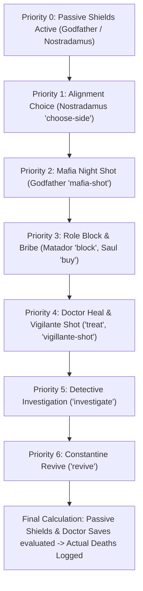

# Mafia Rules & Mechanics

This document provides a comprehensive reference for game mechanics, faction rules, role abilities, night resolution priority, and victory conditions in the Mafia Party Game Assistant (MPGA).

---

## 1. Game Factions & Win Conditions

| Faction | Objective | Win Condition | Color Theme |
| :--- | :--- | :--- | :--- |
| **Town (Citizens)** | Identify and eliminate all Mafia members. | All living Mafia players are eliminated. | `text-town` (Blue / `#3B82F6`) |
| **Mafia** | Eliminate Town members and take control of the town. | The number of living Mafia players equals or exceeds the number of living Town players. | `text-mafia` (Red / `#EF4444`) |
| **Third Party (Nostradamus)** | Align with a chosen faction on Night 1 and survive/assist them. | Wins alongside whichever team (Town or Mafia) they pledged allegiance to on Night 1. | `text-thirdParty` (Purple / `#A855F7`) |

---

## 2. Roles Reference

### Town Faction (`sideId: 'town'`)

* **Citizen (`citizen`)**
  * *Description:* Standard town resident with no active night abilities.
  * *Role in Game:* Relies on daytime debate, intuition, voting patterns, and behavior analysis to eliminate Mafia during the Day and Voting phases.
* **Doctor (`doctor`)**
  * *Active Ability (`treat`):* Chooses one player each night to protect from elimination.
  * *Rules:* If the protected target is attacked by Mafia or Vigilante, the target survives.
* **Detective (`detective`)**
  * *Active Ability (`investigate`):* Investigates one player per night to learn their alignment (`town` or `mafia`).
  * *Rules:* In standard Godfather mode, the Godfather may appear innocent (or have a protective shield depending on mode settings).
* **Constantine (`constantine`)**
  * *Active Ability (`revive`):* Can revive one eliminated player back into the game (typically once per game).
  * *Rules:* Target must be currently dead. The revived player re-enters as an active living player.
* **Leon / Vigilante (`leon`)**
  * *Active Ability (`vigillante-shot`):* Can take a night shot to eliminate a suspected Mafia player.
  * *Rules:* High risk; eliminating an innocent town member harms the Town's majority.

### Mafia Faction (`sideId: 'mafia'`)

* **Godfather (`godfather`)**
  * *Active Ability (`mafia-shot`):* Directs the Mafia's deadly night shot.
  * *Passive Ability (`shield`):* Possesses a bulletproof shield that absorbs one night shot before breaking.
* **Matador (`matador`)**
  * *Active Ability (`block`):* Blocks one player per night, preventing them from using their active night ability.
  * *Rules:* If the Matador blocks a Doctor, Detective, or Vigilante, their action for that night fails.
* **Saul Goodman (`saul-goodman`)**
  * *Active Ability (`buy`):* Can bribe or influence players, creating strategic advantages for the Mafia.
* **Mafia Grunt (`mafia`)**
  * *Description:* Regular Mafia member who participates in team deliberations and voting during the day.

### Third Party (`sideId: 'third-party'`)

* **Nostradamus (`nostradamus`)**
  * *Active Ability (`choose-side`):* On Night 1, Nostradamus secretly chooses which team (Town or Mafia) they want to align with.
  * *Passive Ability (`unlimited-shield`):* Permanent night-shot immunity to ensure fair third-party gameplay.

---

## 3. Night Action Resolution & Priority Engine

Night actions cannot be resolved simultaneously because dependencies exist (e.g., a **Block** must occur before a **Heal** or **Shot**, and **Heals** prevent **Deaths**).

The engine in [`src/services/gameEngine.js`](file:///Users/ali.heristchian/Documents/learning/mpga/src/services/gameEngine.js) processes actions in strict ascending numerical priority:

### Resolution Order Table

| Priority | Action / Ability | Actor | Target Restrictions | Effect / Logic |
| :---: | :--- | :--- | :--- | :--- |
| **0** | `shield` / `unlimited-shield` | Godfather, Nostradamus | Self (Passive) | Protects bearer against deadly shots. |
| **1** | `choose-side` | Nostradamus | Town or Mafia player | Records Nostradamus's chosen win condition. |
| **2** | `mafia-shot` | Godfather | Any other living player | Marks target for elimination unless protected or shielded. |
| **3** | `block` | Matador | Any other living player | Cancels the target's ability if priority > 3. |
| **3** | `buy` | Saul Goodman | Any other living player | Applies bribe effect for the night/day. |
| **4** | `treat` | Doctor | Any living player | Saves target from elimination if shot on the same night. |
| **4** | `vigillante-shot` | Leon (Vigilante) | Any other living player | Marks target for elimination unless healed or shielded. |
| **5** | `investigate` | Detective | Any other living player | Reveals target's faction (`town` vs. `mafia`) in moderator log. |
| **6** | `revive` | Constantine | Dead players only | Restores a dead player back to life (`isDead: false`). |

---

## 4. Game Modes & Balance Rules

Modes are configured in [`src/data/modes.js`](file:///Users/ali.heristchian/Documents/learning/mpga/src/data/modes.js):

* **Godfather Mode:**
  * Minimum Players: 4 (recommended: 8–12)
  * Speaking Time: 40 seconds
  * Borrowed / Challenge Time: 25 seconds
  * Defense Speech Time: 60 seconds
  * Daily Turn Shift: 2 seats
  * Voting Rounding: `ceil` (half of alive players rounded up)
  * Balance Constraint: Maximum Mafia ratio is 34% of total player count.
* **Classic Mafia Mode:**
  * Minimum Players: 4 (recommended: 6–10)
  * Speaking Time: 60 seconds
  * Borrowed / Challenge Time: 30 seconds
  * Defense Speech Time: 60 seconds
  * Daily Turn Shift: 1 seat
  * Voting Rounding: `half` (standard `Math.round`)
  * Balance Constraint: Maximum Mafia ratio is 33% of total player count.
