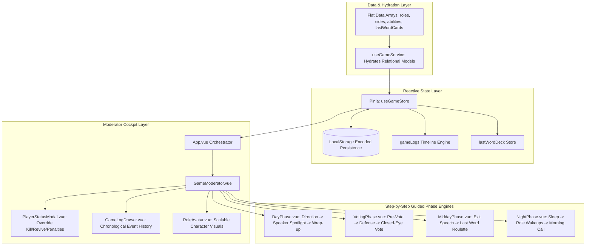

# Technology & Architecture Reference

This document outlines the software architecture, data modeling patterns, state management, and conventions used throughout the **Mafia Party Game Assistant (MPGA)**.

---

## 1. Stack & Tooling

| Technology | Purpose | Key Details |
| :--- | :--- | :--- |
| **Vue 3** | Frontend Framework | Uses Composition API with `<script setup lang="ts">`. |
| **TypeScript** | Type Safety | Full end-to-end type safety, domain models in `src/types/`, strict mode enabled. |
| **Pinia** | State Management | Central reactive store (`useGameStore`) for active game phases, player states, logs, and card decks. |
| **PeerJS (WebRTC)** | Serverless P2P Multiplayer | Direct browser-to-browser P2P data channels connecting Host and Player devices without a dedicated backend server. |
| **qrcode.vue** | Dynamic QR Generation | Generates sharp SVG QR codes for quick mobile device pairing and seat claiming. |
| **Web Audio API** | Procedural Sound FX Engine | Pure synthesized audio cues (countdowns, gongs, night/dawn chimes, roulette ticks, fanfare) with zero external asset files. |
| **Vite** | Build Tool & Dev Server | Fast Hot Module Replacement (HMR) and optimized rollup production bundles. |
| **Tailwind CSS v3** | Styling & Theming | Utility-first CSS with dark theme (`gray-900`/`gray-800`), atmospheric phase themes, and faction colors (`town`, `mafia`, `thirdParty`). |
| **Vue I18n v11** | Internationalization | All user-facing strings isolated in `src/locales/en.json` (no hardcoded template strings). |
| **Vitest** | Unit & Service Testing | Fast unit test runner for the game engine, store operations, audio, multiplayer, and logging logic. |
| **ESLint v9 & Prettier** | Code Quality & Formatting | Flat configuration with Vue plugin rules and automated formatting. |

---

## 2. Directory Structure

```
mpga/
├── docs/                         # Comprehensive technical & gameplay documentation
│   ├── how-to-play.md            # Game lifecycle, rules, and moderation steps
│   ├── how-to-run.md             # Setup, build, testing, and script commands
│   ├── rules.md                  # Faction rules, roles, last word cards, and priority tables
│   ├── technology.md             # System architecture and data modeling
│   └── roadmap.md                # Completed milestones and future todos
├── src/
│   ├── components/               # Declarative Vue SFC components
│   │   ├── BaseModal.vue         # Reusable Teleport modal with slot injection
│   │   ├── GameGuideModal.vue    # Interactive role glossary and rulebook modal
│   │   ├── GameLogDrawer.vue     # Sliding historical event log & filter drawer
│   │   ├── GameModerator.vue     # Main moderator cockpit & player manager
│   │   ├── GameOverModal.vue     # Victory celebration modal & match statistics aggregator
│   │   ├── LanguageSwitcher.vue  # Bilingual EN/FA toggle with reactive RTL/LTR direction switching
│   │   ├── ModeSelection.vue     # Game ruleset selector (Godfather, Classic)
│   │   ├── PhaseHeroBanner.vue   # Thematic SVG scenery & atmosphere banner for sub-phases
│   │   ├── PlayerEntry.vue       # Seating order manager with HTML5 Drag-and-Drop
│   │   ├── PlayerStatusModal.vue # Anytime moderator override modal (Kill/Revive/Penalties)
│   │   ├── RoleAvatar.vue        # Scalable SVG vector character artwork & faction ring
│   │   ├── RoleSelection.vue     # Faction-based role picker with balance validator
│   │   ├── SoundtrackConsole.vue # Ambient music console & playlist controller
│   │   ├── game/                 # Sub-phase step-by-step guided wizards
│   │   │   ├── DayPhase.vue      # Solar Amber theme, speaker spotlight & challenge timer
│   │   │   ├── MatchReplayModal.vue # Interactive scrubbable match timeline & turn-by-turn replay
│   │   │   ├── MatchStoryCardModal.vue # Canvas graphic story card generator for sharing
│   │   │   ├── MiddayPhase.vue   # Twilight theme, exit speech & Last Word card roulette
│   │   │   ├── NightPhase.vue    # Midnight theme, role wakeup teleprompter wizard
│   │   │   └── VotingPhase.vue   # Courtroom theme, pre-vote, defense, & closed-eye vote
│   │   ├── multiplayer/
│   │   │   └── MultiplayerHostModal.vue # Lobby host console with QR code & network diagnostics
│   │   ├── player/
│   │   │   └── PlayerClient.vue  # Mobile touch player console with private role & voting
│   │   ├── projector/
│   │   │   └── ProjectorView.vue # TV/Projector public display mode for living room screens
│   │   └── studio/
│   │       └── RoleStudioModal.vue # In-browser Rule Customizer, Character Studio & Pack Manager
│   ├── data/                     # Flat, relational data definitions (JSON-ready)
│   │   ├── abilities.ts          # Active/passive abilities and priority values
│   │   ├── lastWordCards.ts      # Last Word cards data definitions
│   │   ├── modeIllustrations.ts  # Vector SVG artwork for game modes
│   │   ├── modes.ts              # Mode configurations and balance rules
│   │   ├── phases.ts             # Phase IDs and metadata
│   │   ├── roleGuideData.ts      # Structured role guide glossary & how-to-play info
│   │   ├── roleIllustrations.ts  # Scalable vector SVG illustrations for character roles
│   │   ├── roles.ts              # Role definitions, limits, and foreign keys
│   │   ├── sides.ts              # Factions (Town, Mafia, Third Party)
│   │   └── soundtracks.ts        # Phase background music playlists & stream resolver
│   ├── locales/                  # Localization dictionaries
│   │   ├── en.json               # English translations (clean strings)
│   │   └── fa.json               # Persian translations (authentic Mafia terminology)
│   ├── services/                 # Core business logic and service layers
│   │   ├── gameEngine.ts         # Pure Night Action Priority Resolution Engine
│   │   ├── gameEngine.spec.ts    # Unit tests for resolution logic
│   │   ├── useAudioService.ts    # Web Audio API procedural sound synthesizer & streaming
│   │   ├── useGamePackService.ts # Game Pack schema validation, import/export & presets
│   │   ├── useGamePackService.spec.ts # Unit tests for game pack validation and storage
│   │   ├── useGameService.ts     # Hydration composable connecting relational data
│   │   ├── useHaptics.ts         # Tactile vibration feedback composable
│   │   ├── useMatchReplay.ts     # Turn-by-turn match timeline replay engine
│   │   ├── useMultiplayerService.ts # Dual-transport MQTT/WebRTC networking composable
│   │   ├── useVoiceNarration.ts  # Web Speech API speech synthesis narrator
│   │   ├── useVotingService.ts   # Voting calculations (threshold, clamping, pre-vote/final)
│   │   ├── useVotingService.spec.ts # Unit tests for voting calculation service
│   │   ├── useWakeLock.ts        # Screen Wake Lock API composable
│   │   ├── useWinCondition.ts    # Win Condition Evaluation Engine & Match Statistics Aggregator
│   │   └── useWinCondition.spec.ts # Unit tests for win condition calculation
│   ├── stores/                   # Pinia store definitions
│   │   ├── gameStore.ts          # Master state (phases, players, logs, card decks, win state)
│   │   └── gameStore.spec.ts     # Unit tests for game store state & actions
│   ├── types/                    # TypeScript domain interfaces & type definitions
│   │   ├── audio.ts              # Audio track and playlist types
│   │   ├── cards.ts              # Last Word card and mode types
│   │   ├── game.ts               # Game mode, log, voting, and engine types
│   │   ├── multiplayer.ts        # Network packet and connection state types
│   │   ├── role.ts               # Role, side, ability, and hydration types
│   │   └── index.ts              # Central export barrel
│   ├── utils/                    # Utilities and helper modules
│   │   └── storage.ts            # Base64/URI encoded LocalStorage persistence
│   ├── App.vue                   # Top-level orchestrator component
│   └── main.ts                   # App bootstrap (Vue, Pinia, VueI18n, Tailwind)
```

---

## 3. Key Architectural Decisions



### 1. Declarative Single Source of Truth & Role Engine
* Data in [`src/data/roles.ts`](file:///Users/ali.heristchian/Documents/learning/mpga/src/data/roles.ts) and [`src/data/abilities.ts`](file:///Users/ali.heristchian/Documents/learning/mpga/src/data/abilities.ts) serves as the 100% declarative single source of truth for the entire application.
* **Auto-Generated Game Guide & Resolution Ladder:** [`src/data/roleGuideData.ts`](file:///Users/ali.heristchian/Documents/learning/mpga/src/data/roleGuideData.ts) dynamically compiles `roleGuideData` and `nightResolutionSteps` from role and ability definitions rather than relying on redundant static arrays.
* **Composable Hydration & Action Derivation:** The hydration service ([`src/services/useGameService.ts`](file:///Users/ali.heristchian/Documents/learning/mpga/src/services/useGameService.ts)) combines foreign keys into rich nested structures on demand and exposes `getAvailableNightActions(role)` which automatically derives active night abilities and appends standard pass choices for both the host teleprompter ([`NightPhase.vue`](file:///Users/ali.heristchian/Documents/learning/mpga/src/components/game/NightPhase.vue)) and player phones ([`PlayerClient.vue`](file:///Users/ali.heristchian/Documents/learning/mpga/src/components/player/PlayerClient.vue)).

### 2. State Management & Pinia Architecture
* Global game state is managed in [`src/stores/gameStore.js`](file:///Users/ali.heristchian/Documents/learning/mpga/src/stores/gameStore.js):
  * `gamePhase`: Top-level navigation (`mode-selection` $\rightarrow$ `setup` $\rightarrow$ `role-selection` $\rightarrow$ `playing`).
  * `gameMode`: Active ruleset object.
  * `players`: Original registered player list.
  * `livePlayers`: In-game dynamic status list (tracking `isDead`, `warnings`, `isSilenced`, active roles).
  * `subPhase`: Current in-game phase (`day`, `voting`, `midday`, `night`).
  * `currentDay`: Current integer round counter.
  * `gameLogs`: Complete chronological array of `{ id, timestamp, day, phase, type, title, detail, player }` events.
  * `lastWordDeck`: Active pool of unplayed Last Word cards.
  * `drawnLastWordCards`: History of drawn and retired Last Word cards.
* **Storage Auto-Sync:** Store subscriptions automatically persist state to `localStorage` via Base64/URI encoding wrappers.

### 3. Step-by-Step Guided UX Patterns
* Instead of presenting cluttered, multi-form UIs, all sub-phase components are organized into linear, guided wizards with dedicated timers, teleprompter cues, and progressive disclosure.

### 4. Internationalization (i18n) & Persian RTL Architecture
* **Pure Clean Dictionaries:** All user-facing strings are strictly extracted into [`src/locales/en.json`](file:///Users/ali.heristchian/Documents/learning/mpga/src/locales/en.json) and [`src/locales/fa.json`](file:///Users/ali.heristchian/Documents/learning/mpga/src/locales/fa.json) (no mixed strings or hardcoded template text).
* **Language Switcher & Directionality:** [`LanguageSwitcher.vue`](file:///Users/ali.heristchian/Documents/learning/mpga/src/components/LanguageSwitcher.vue) allows instant switching between English (`en`) and Persian (`fa`). When Persian is selected, `document.documentElement.dir` is dynamically set to `rtl`, adapting all layout and typography directions.
* **Persistent Preference:** Locale is stored in `localStorage.getItem('mpga_locale')` and initialized automatically on app boot.

### 5. Automatic Win Condition & Post-Game Statistics Engine
* Pure calculation service [`src/services/useWinCondition.js`](file:///Users/ali.heristchian/Documents/learning/mpga/src/services/useWinCondition.js) monitors living factions (`livingMafiaCount === 0` for Town, `livingMafiaCount >= livingTownCount` for Mafia).
* Automatically checks win state on player death status changes, morning resolutions, and day transitions.
* Aggregates post-match metrics directly from `gameLogs` (total doctor saves, successful detective inquiries, eliminations, day count) and lists surviving players with their role art.
* Managed through [`GameOverModal.vue`](file:///Users/ali.heristchian/Documents/learning/mpga/src/components/GameOverModal.vue) with non-destructive board inspection (moderator can dismiss and reopen at will).

### 6. Atmospheric Vector Art & Scenery System
* Zero external asset dependencies: scalable, lightweight vector SVGs defined in [`src/data/roleIllustrations.js`](file:///Users/ali.heristchian/Documents/learning/mpga/src/data/roleIllustrations.js) and [`src/components/PhaseHeroBanner.vue`](file:///Users/ali.heristchian/Documents/learning/mpga/src/components/PhaseHeroBanner.vue).
* Dynamic faction lighting glows, death state overlays, and responsive sizing across all screen widths.

### 7. Dual-Transport Multiplayer Architecture (Cloud Relay & WebRTC P2P)
* **Flexible Transport Engines:** Hosts and players can connect via two robust transport engines:
  1. **☁️ Cloud Relay (MQTT over Secure WebSockets - Recommended):**
     - Powered by the public high-availability MQTT broker (`wss://broker.hivemq.com:8884/mqtt`).
     - Ultra-stable, 0% disconnect rate, works seamlessly across all networks, restrictive mobile carrier CGNAT (4G/5G), and public Wi-Fi without NAT/STUN hurdles.
     - Topic isolation per game room (`mpga/{roomCode}/host`, `mpga/{roomCode}/public`, and `mpga/{roomCode}/client/{senderId}`).
     - Live 3.5s bidirectional ping/pong measuring network latency (`pingLatency` in ms).
  2. **⚡ WebRTC P2P (Direct PeerJS):**
     - Direct browser-to-browser data channel communication, 100% serverless.
     - Hardened with 3-second DataChannel keep-alive heartbeat frames preventing NAT firewall timeouts.
     - Fixed room code persistence preventing ID mutation during signaling blips.
     - Backed by Google STUN (`stun.l.google.com:19302`) and OpenRelay TURN relays (`openrelay.metered.ca`).
* **Instant Engine Switching & Dynamic URL Sharing:**
  - Moderator can switch between Cloud Relay and WebRTC P2P at any time directly in the lobby and host modals.
  - Join URLs and QR codes dynamically encode the selected transport engine (`&t=cloud` or `&t=webrtc`).
  - Mobile clients automatically parse the transport parameter and pair using the appropriate transport without manual configuration.
* **Live Room Lobby & Passcode Protocol:**
  - **Room PIN / Passcode Verification:** Host can configure an optional PIN (`roomPasscode`). When a player connects with `{ type: 'JOIN_LOBBY', playerName, passcode }`, the host validates the passcode before registering the player.
  - **Dual Entry Modes:** Moderator can use **Live Room Lobby** (where player phones join dynamically to populate the roster) or **Manual Entry** (traditional text input).
  - **Live Setup Synchronization:** `sanitizePublicGameState(store)` includes `setupPlayers` during the setup phase, so players in the lobby see other connected peers in real time.
  - **Seamless Role Auto-Dispatch:** When the moderator finalizes roles and starts the game, role assignments are automatically pushed to connected peer devices, smoothly transitioning players from the lobby waiting screen to their private secret role reveal card.
* **Strict Privacy Isolation & Sanitization:**
  - `sanitizePlayerPayload(player)` transmits secret role info only to the specific connected device that claimed that seat.
  - `sanitizePublicGameState(store)` strips all foreign secret roles and internal notes, broadcasting only public roster statuses and speaker cues.
* **Mobile Client View (`PlayerClient.vue`):**
  - Standalone mobile interface featuring Room PIN authentication, live transport badge, latency indicator (ms), Lobby Waiting Room with live player roster, tap-to-reveal secret role cards, live speaker spotlight synchronization, night action target selection with immediate detective feedback, voting ballots, and timeout/retry recovery actions.

### 8. Procedural Web Audio Sound FX & CDN Soundtrack Engine
* **Sound FX Engine:** Synthesizes procedural sound cues directly via the browser's native Web `AudioContext`:
  * **Countdown Ticks:** Subtle 800 Hz sine clicks for the final 10 seconds of a speaking/defense turn.
  * **Urgent Ticks:** 1200 Hz alert clicks for the final 3 seconds.
  * **Gong:** Multi-harmonic gong (110 Hz fundamental, 220 Hz, 330 Hz, 440 Hz) with exponential decay on timer expiration.
  * **Night Fall:** Descending D-minor chord arpeggio (A4 $\rightarrow$ F4 $\rightarrow$ D4) on night arrival.
  * **Dawn Rise:** Ascending C-major chord arpeggio (C4 $\rightarrow$ E4 $\rightarrow$ G4 $\rightarrow$ C5) on morning wake-up.
  * **Roulette Wheel:** Mechanical tick sound during Destiny Spin and Last Word Card selection.
  * **Victory Fanfare:** Triumphant brass-like major chord fanfare upon match conclusion.
* **Soundtrack Configuration & Music Playback ([`src/data/soundtracks.js`](file:///Users/ali.heristchian/Documents/learning/mpga/src/data/soundtracks.js)):**
  * **Phase Playlists:** Dedicated music playlists for all game phases and scenes (`lobby`, `day`, `voting`, `midday`, `night`, `victory`). The default orchestral stems were originally generated with Suno AI and are served directly from high-speed GitHub Release CDN assets.
  * **Winner-Specific Victory Soundtracks:** Automatically plays faction-tailored victory themes upon match resolution (`Victory-1.mp3` for Mafia, `Victory-2.mp3` for Town, `Victory-3.mp3` for Third-Party / Nostradamus).
  * **Midday & Last Words Soundtrack:** Plays tailored tension music (`Midday-1.mp3`) while eliminated players give their final speech and draw cards.
  * **Direct Audio Stream URL Engine (`resolveAudioUrl`):** Clean, protocol-agnostic audio URL resolver that directly feeds HTML5 audio streams with zero third-party parsing overhead.
  * **Auto-DJ Dual-Element Crossfading & Fade-In:** Smoothly fades in when starting playback or resuming/unmuting, and executes true dual-element crossfading using equal-power trigonometric curves (`Math.sin` / `Math.cos`) when transitioning between tracks and phases.
  * **Moderator Music Console (`SoundtrackConsole.vue`):** Dedicated UI for testing tracks, managing volume, toggling Auto-DJ, and previewing phase soundtracks on the fly.
* **Persistent Preferences:** Reactive volume and mute states (`useAudio().musicVolume`, `useAudio().autoPlayOnPhaseChange`, `useAudio().isMuted`) synchronized with `localStorage`.

---

## 4. License & Open-Source Terms

* **Copyright (C) 2026 Ali Heristchian.**
* Licensed under the **GNU General Public License v3.0 (GPL-3.0-or-later)**.
* You are free to run, copy, distribute, study, and modify this software. Any derivative works or distributed modified versions must also remain licensed under GPL-3.0. See [`LICENSE`](file:///Users/ali.heristchian/Documents/learning/mpga/LICENSE) for complete terms.

