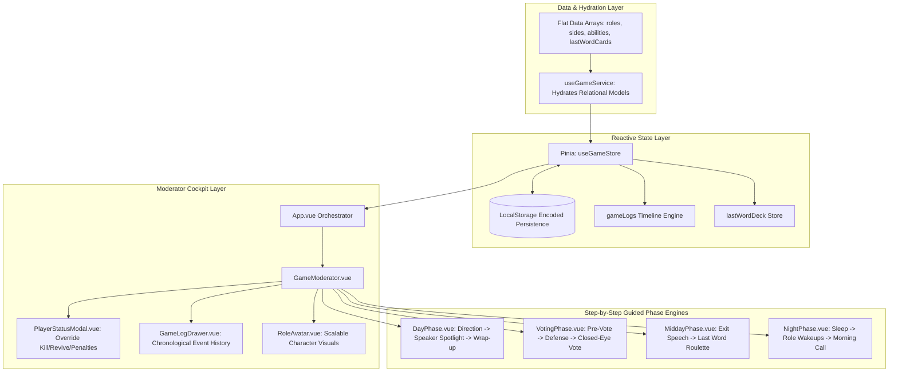

# Technology & Architecture Reference

This document outlines the software architecture, data modeling patterns, state management, and conventions used throughout the **Mafia Party Game Assistant (MPGA)**.

---

## 1. Stack & Tooling

| Technology | Purpose | Key Details |
| :--- | :--- | :--- |
| **Vue 3** | Frontend Framework | Uses Composition API with `<script setup>`. |
| **Pinia** | State Management | Central reactive store (`useGameStore`) for active game phases, player states, logs, and card decks. |
| **PeerJS (WebRTC)** | Serverless P2P Multiplayer | Direct browser-to-browser P2P data channels connecting Host and Player devices without a dedicated backend server. |
| **qrcode.vue** | Dynamic QR Generation | Generates sharp SVG QR codes for quick mobile device pairing and seat claiming. |
| **Web Audio API** | Procedural Sound FX Engine | Pure synthesized audio cues (countdowns, gongs, night/dawn chimes, roulette ticks, fanfare) with zero external asset files. |
| **Vite** | Build Tool & Dev Server | Fast Hot Module Replacement (HMR) and optimized rollup production bundles. |
| **Tailwind CSS v3** | Styling & Theming | Utility-first CSS with dark theme (`gray-900`/`gray-800`), atmospheric phase themes, and faction colors (`town`, `mafia`, `thirdParty`). |
| **Vue I18n v11** | Internationalization | All user-facing strings isolated in `src/locales/en.json` (no hardcoded template strings). |
| **Vitest** | Unit & Service Testing | Fast unit test runner for the game engine, store operations, audio, multiplayer, and logging logic. |
| **ESLint v9 & Prettier** | Code Quality & Formatting | Flat configuration with Vue plugin rules and automated formatting. |

---

## 2. Directory Structure

```
mpga/
├── docs/                         # Comprehensive technical & gameplay documentation
│   ├── how-to-play.md            # Game lifecycle, rules, and moderation steps
│   ├── how-to-run.md             # Setup, build, testing, and script commands
│   ├── rules.md                  # Faction rules, roles, last word cards, and priority tables
│   ├── technology.md             # System architecture and data modeling
│   └── roadmap.md                # Completed milestones and future todos
├── src/
│   ├── components/               # Declarative Vue SFC components
│   │   ├── BaseModal.vue         # Reusable Teleport modal with slot injection
│   │   ├── GameLogDrawer.vue     # Sliding historical event log & filter drawer
│   │   ├── GameModerator.vue     # Main moderator cockpit & player manager
│   │   ├── GameOverModal.vue     # Victory celebration modal & match statistics aggregator
│   │   ├── ModeSelection.vue     # Game ruleset selector (Godfather, Classic)
│   │   ├── PhaseHeroBanner.vue   # Thematic SVG scenery & atmosphere banner for sub-phases
│   │   ├── PlayerEntry.vue       # Seating order manager with HTML5 Drag-and-Drop
│   │   ├── PlayerStatusModal.vue # Anytime moderator override modal (Kill/Revive/Penalties)
│   │   ├── RoleAvatar.vue        # Scalable SVG vector character artwork & faction ring
│   │   ├── RoleSelection.vue     # Faction-based role picker with balance validator
│   │   └── game/                 # Sub-phase step-by-step guided wizards
│   │       ├── DayPhase.vue      # Solar Amber theme, speaker spotlight & challenge timer
│   │       ├── VotingPhase.vue   # Courtroom theme, pre-vote, defense, & closed-eye vote
│   │       ├── MiddayPhase.vue   # Twilight theme, exit speech & Last Word card roulette
│   │       └── NightPhase.vue    # Midnight theme, role wakeup teleprompter wizard
│   ├── data/                     # Flat, relational data definitions (JSON-ready)
│   │   ├── abilities.js          # Active/passive abilities and priority values
│   │   ├── lastWordCards.js      # Last Word cards data definitions
│   │   ├── modes.js              # Mode configurations and balance rules
│   │   ├── phases.js             # Phase IDs and metadata
│   │   ├── roleIllustrations.js  # Scalable vector SVG illustrations for all 9 character roles
│   │   ├── roles.js              # Role definitions, limits, and foreign keys
│   │   └── sides.js              # Factions (Town, Mafia, Third Party)
│   ├── locales/                  # Localization dictionaries
│   │   └── en.json               # English translations (i18n compliant)
│   ├── services/                 # Core business logic and service layers
│   │   ├── gameEngine.js         # Pure Night Action Priority Resolution Engine
│   │   ├── gameEngine.spec.js    # Unit tests for resolution logic
│   │   ├── useGameService.js     # Hydration composable connecting relational data
│   │   ├── useVotingService.js   # Voting calculations (threshold, alive - 1 candidate max cap, clamping)
│   │   ├── useVotingService.spec.js # Unit tests for voting calculation service
│   │   ├── useWinCondition.js    # Win Condition Evaluation Engine & Match Statistics Aggregator
│   │   └── useWinCondition.spec.js # Unit tests for win condition calculation
│   ├── stores/                   # Pinia store definitions
│   │   ├── gameStore.js          # Master state (phases, players, logs, card decks, win state)
│   │   └── gameStore.spec.js     # Unit tests for game store state & actions
│   ├── utils/                    # Utilities and helper modules
│   │   └── storage.js            # Base64/URI encoded LocalStorage persistence
│   ├── App.vue                   # Top-level orchestrator component
│   └── main.js                   # App bootstrap (Vue, Pinia, VueI18n, Tailwind)
```

---

## 3. Key Architectural Decisions



### 1. Relational Data Modeling & Headless CMS Prep
* Data in [`src/data/`](file:///Users/ali.heristchian/Documents/learning/mpga/src/data/) is modeled relationally using string foreign keys.
* The hydration service ([`src/services/useGameService.js`](file:///Users/ali.heristchian/Documents/learning/mpga/src/services/useGameService.js)) combines foreign keys into rich nested structures on demand.

### 2. State Management & Pinia Architecture
* Global game state is managed in [`src/stores/gameStore.js`](file:///Users/ali.heristchian/Documents/learning/mpga/src/stores/gameStore.js):
  * `gamePhase`: Top-level navigation (`mode-selection` $\rightarrow$ `setup` $\rightarrow$ `role-selection` $\rightarrow$ `playing`).
  * `gameMode`: Active ruleset object.
  * `players`: Original registered player list.
  * `livePlayers`: In-game dynamic status list (tracking `isDead`, `warnings`, `isSilenced`, active roles).
  * `subPhase`: Current in-game phase (`day`, `voting`, `midday`, `night`).
  * `currentDay`: Current integer round counter.
  * `gameLogs`: Complete chronological array of `{ id, timestamp, day, phase, type, title, detail, player }` events.
  * `lastWordDeck`: Active pool of unplayed Last Word cards.
  * `drawnLastWordCards`: History of drawn and retired Last Word cards.
* **Storage Auto-Sync:** Store subscriptions automatically persist state to `localStorage` via Base64/URI encoding wrappers.

### 3. Step-by-Step Guided UX Patterns
* Instead of presenting cluttered, multi-form UIs, all sub-phase components are organized into linear, guided wizards with dedicated timers, teleprompter cues, and progressive disclosure.

### 4. Internationalization (i18n) Enforcement
* All UI text is referenced via `$t('namespace.key')` or `<i18n-t>` tags in [`src/locales/en.json`](file:///Users/ali.heristchian/Documents/learning/mpga/src/locales/en.json).

### 5. Automatic Win Condition & Post-Game Statistics Engine
* Pure calculation service [`src/services/useWinCondition.js`](file:///Users/ali.heristchian/Documents/learning/mpga/src/services/useWinCondition.js) monitors living factions (`livingMafiaCount === 0` for Town, `livingMafiaCount >= livingTownCount` for Mafia).
* Automatically checks win state on player death status changes, morning resolutions, and day transitions.
* Aggregates post-match metrics directly from `gameLogs` (total doctor saves, successful detective inquiries, eliminations, day count) and lists surviving players with their role art.
* Managed through [`GameOverModal.vue`](file:///Users/ali.heristchian/Documents/learning/mpga/src/components/GameOverModal.vue) with non-destructive board inspection (moderator can dismiss and reopen at will).

### 6. Atmospheric Vector Art & Scenery System
* Zero external asset dependencies: scalable, lightweight vector SVGs defined in [`src/data/roleIllustrations.js`](file:///Users/ali.heristchian/Documents/learning/mpga/src/data/roleIllustrations.js) and [`src/components/PhaseHeroBanner.vue`](file:///Users/ali.heristchian/Documents/learning/mpga/src/components/PhaseHeroBanner.vue).
* Dynamic faction lighting glows, death state overlays, and responsive sizing across all screen widths.

### 7. Serverless P2P Multiplayer Architecture
* **Zero Backend Hosting:** Built using PeerJS over WebRTC direct data channels.
* **STUN/TURN Relay Network:**
  * Configured with Google STUN (`stun.l.google.com:19302`) and OpenRelay TURN relays (`openrelay.metered.ca`) over UDP and TCP (ports 80 and 443).
  * Guarantees reliable NAT traversal across mobile carrier CGNAT (4G/5G), home routers, and strict corporate firewalls.
* **Connection Resilience & Lifecycle:**
  * **Keep-Alive Heartbeats:** Periodic 20-second ping frames prevent cloud signaling WebSocket drops.
  * **Auto-Reconnection:** Dedicated handlers for `disconnected` peer states automatically reconnect to the broker without losing game state.
  * **Clean Teardown:** `beforeunload` lifecycle hooks cleanly destroy signaling registrations on tab close to prevent stale ID collisions.
  * **Persistent Host Listening:** Host automatically starts listening on page load with a persistent Room Code stored in `localStorage`.
* **Host Synchronization (`useMultiplayerService.js`):**
  * Moderator acts as the WebRTC Room Host (`mpga-host-${roomCode.toLowerCase()}`).
  * Emits an SVG QR code (`qrcode.vue`) and shareable link (`?join=CODE`) for one-tap mobile pairing.
  * Immediately pushes a full state handshake to newly connecting devices upon connection open.
* **Strict Privacy Isolation & Sanitization:**
  * `sanitizePlayerPayload(player)` transmits secret role info only to the specific connected device that claimed that seat.
  * `sanitizePublicGameState(store)` strips all foreign secret roles and internal notes, broadcasting only public roster statuses and speaker cues.
* **Mobile Client View (`PlayerClient.vue`):**
  * Standalone mobile interface featuring one-tap seat claiming from the live roster, tap-to-reveal secret role cards, live speaker spotlight synchronization, night action target selection with immediate detective feedback, voting ballots, and timeout/retry recovery actions.

### 8. Procedural Web Audio Sound FX Engine
* Zero audio files or external CDN dependencies implemented in [`src/services/useAudioService.js`](file:///Users/ali.heristchian/Documents/learning/mpga/src/services/useAudioService.js).
* Synthesizes rich procedural sound effects using the browser's native `AudioContext`:
  * **Countdown Ticks:** Subtle 800 Hz sine clicks for the final 10 seconds of a speaking/defense turn.
  * **Urgent Ticks:** 1200 Hz alert clicks for the final 3 seconds.
  * **Gong:** Multi-harmonic gong (110 Hz fundamental, 220 Hz, 330 Hz, 440 Hz) with exponential decay on timer expiration.
  * **Night Fall:** Descending D-minor chord arpeggio (A4 $\rightarrow$ F4 $\rightarrow$ D4) on night arrival.
  * **Dawn Rise:** Ascending C-major chord arpeggio (C4 $\rightarrow$ E4 $\rightarrow$ G4 $\rightarrow$ C5) on morning wake-up.
  * **Roulette Wheel:** Mechanical tick sound during Destiny Spin and Last Word Card selection.
  * **Victory Fanfare:** Triumphant brass-like major chord fanfare upon match conclusion.
* **Persistent Mute:** Reactive global audio toggle (`useAudio().isMuted`) synchronized across sessions with `localStorage`.
