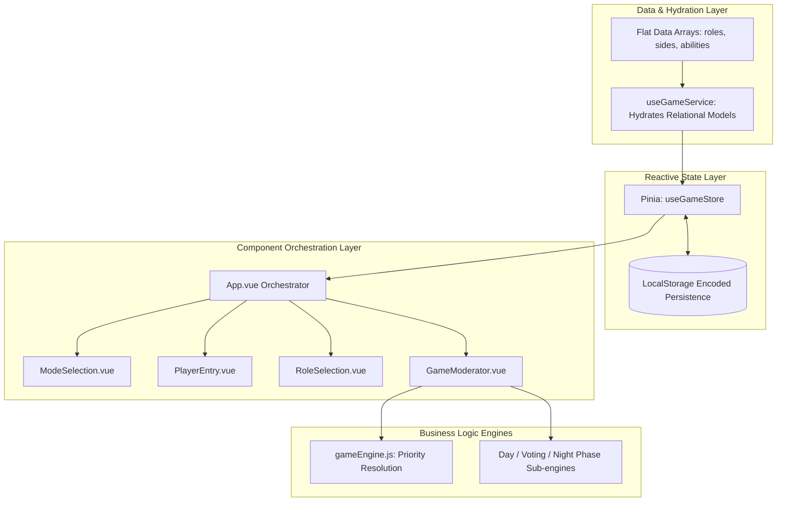

# Technology & Architecture Reference

This document outlines the software architecture, data modeling patterns, state management, and conventions used throughout the **Mafia Party Game Assistant (MPGA)**.

---

## 1. Stack & Tooling

| Technology | Purpose | Key Details |
| :--- | :--- | :--- |
| **Vue 3** | Frontend Framework | Uses Composition API with `<script setup>`. |
| **Pinia** | State Management | Central reactive store (`useGameStore`) for active game phases, players, and days. |
| **Vite** | Build Tool & Dev Server | Fast Hot Module Replacement (HMR) and optimized rollup production bundles. |
| **Tailwind CSS v3** | Styling & Theme | Utility-first CSS with dark theme (`gray-900`/`gray-800`) and custom faction colors (`town`, `mafia`, `thirdParty`). |
| **Vue I18n v11** | Internationalization | User-facing strings isolated in `src/locales/en.json` (no hardcoded template strings). |
| **Vitest** | Unit & Service Testing | Fast unit test runner for the game engine and state operations. |
| **ESLint v9 & Prettier** | Code Quality & Formatting | Flat configuration with Vue plugin rules and automated formatting. |

---

## 2. Directory Structure

```
mpga/
├── docs/                      # Comprehensive technical & gameplay documentation
│   ├── how-to-play.md         # Game lifecycle, rules, and moderation steps
│   ├── how-to-run.md          # Setup, build, testing, and script commands
│   ├── rules.md               # Faction rules, roles, and priority tables
│   ├── technology.md          # System architecture and data modeling
│   └── roadmap.md             # Upcoming milestones and future todos
├── src/
│   ├── components/            # Declarative Vue SFC components
│   │   ├── BaseModal.vue      # Reusable Teleport modal with slot injection
│   │   ├── GameModerator.vue  # Main moderator dashboard container
│   │   ├── ModeSelection.vue  # Game ruleset selector (Godfather, Classic)
│   │   ├── PlayerEntry.vue    # Seating order manager with HTML5 Drag-and-Drop
│   │   ├── RoleSelection.vue  # Faction-based role picker with balance validator
│   │   └── game/              # Sub-phase moderation components
│   │       ├── DayPhase.vue   # Turn timers, speaking queues, and shift offsets
│   │       ├── VotingPhase.vue# Pre-vote, defense, and final vote stages
│   │       └── NightPhase.vue # Action entry and priority resolution UI
│   ├── data/                  # Flat, relational data definitions (JSON-ready)
│   │   ├── abilities.js       # Active/passive abilities and priority values
│   │   ├── modes.js           # Mode configurations and balance rules
│   │   ├── phases.js          # Phase IDs and metadata
│   │   ├── roles.js           # Role definitions, limits, and foreign keys
│   │   └── sides.js           # Factions (Town, Mafia, Third Party)
│   ├── locales/               # Localization dictionaries
│   │   └── en.json            # English translations
│   ├── services/              # Core business logic and service layers
│   │   ├── gameEngine.js      # Pure Night Action Priority Resolution Engine
│   │   ├── gameEngine.spec.js # Unit tests for resolution logic
│   │   └── useGameService.js  # Hydration composable connecting relational data
│   ├── stores/                # Pinia store definitions
│   │   └── gameStore.js       # Master state (phase, mode, players, day)
│   ├── utils/                 # Utilities and helper modules
│   │   └── storage.js         # Base64/URI encoded LocalStorage persistence
│   ├── App.vue                # Top-level orchestrator component
│   └── main.js                # App bootstrap (Vue, Pinia, VueI18n, Tailwind)
```

---

## 3. Key Architectural Decisions



### 1. Relational Data Modeling & Headless CMS Prep
* Data in [`src/data/`](file:///Users/ali.heristchian/Documents/learning/mpga/src/data/) is modeled relationally using string foreign keys (e.g., `role.sideId = 'mafia'`, `role.abilityIds = ['sixth-sense', 'mafia-shot']`).
* The hydration service ([`src/services/useGameService.js`](file:///Users/ali.heristchian/Documents/learning/mpga/src/services/useGameService.js)) combines foreign keys into rich nested structures on demand. This allows swapping static files with a Headless CMS (e.g., Strapi, Directus, or Supabase) with zero changes to UI components.

### 2. State Management & Pinia Architecture
* Global game state is managed in [`src/stores/gameStore.js`](file:///Users/ali.heristchian/Documents/learning/mpga/src/stores/gameStore.js):
  * `gamePhase`: Top-level navigation (`mode-selection` $\rightarrow$ `setup` $\rightarrow$ `role-selection` $\rightarrow$ `playing`).
  * `gameMode`: Active ruleset object.
  * `players`: Original registered player list.
  * `livePlayers`: In-game dynamic status list (tracking `isDead`, active roles).
  * `subPhase`: Current in-game phase (`day`, `voting`, `midday`, `night`).
  * `currentDay`: Current integer round counter.
* **Storage Auto-Sync:** Store changes automatically trigger base64-encoded saves to `localStorage` via `store.$subscribe`.

### 3. Pure Priority Engine (`gameEngine.js`)
* Night action calculations are isolated as pure functions without side effects.
* Actions are sorted by priority numbers ($0 \rightarrow 6$) and processed sequentially.
* Unit tests in [`gameEngine.spec.js`](file:///Users/ali.heristchian/Documents/learning/mpga/src/services/gameEngine.spec.js) verify edge cases such as:
  * Matador blocking Doctor/Leon.
  * Doctor saving a shot target.
  * Passive shields absorbing shots.
  * Detective investigations and Constantine revives.

### 4. Internationalization (i18n) Enforcement
* All UI text is referenced via `$t('namespace.key')` or `<i18n-t>` tags.
* Hardcoding user-facing strings in templates or data structures is strictly disallowed.
